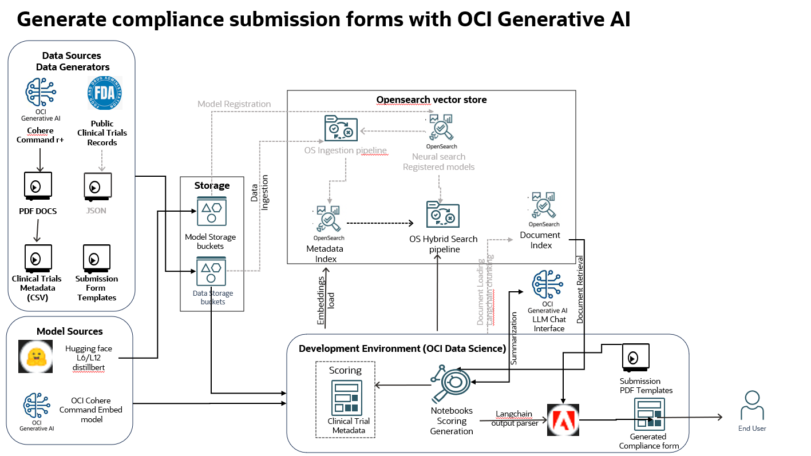

# Introduction

Organizations today are challenged with analyzing large amounts of structured and unstructured data such as tables, invoices, reports for compliance reporting to regulatory authorities accurately.This requires analyzing, filtering and summarizing large volume of textual and tabular data that are typically resident in an enterprise lakehouse, on-premise servers and cloud. Producing outputs accurately and timely that conforms to a form template is a big time and effort consuming task and hence enterprises are looking to Artificial Intelligence to solve this issue

## About this Workshop

So, in this hands-on lab, we will show how you can auto-generate and fill up compliance forms summarizing information from a pool of  PDF documents to submit to regulatory authorities. This lab uses OCI Generative AI tool sets to generate custom content from a healthcare organization clinical trial dataset. 

To maintain generic nature of the lab and data compliance, all source clinical trial data is auto-generated by OCI Generative AI model such as Cohere Command R+.

Learn more about the architecture, methodology and the key automation steps that can be adopted to scale compliance document generation across your enterprise knowledge base.

## Solution blueprint

* Generic RAG framework with OCI only tools 
* Supports multiple data sources, embedding options, models and llm usage
* OCI Gen AI generated source data
* Ability to score and compare various vector embedding functions
* Scoring based on Clinical trial metadata
* Both open source and OCI gen AI embedding functions 
* OCI chat llm based summarization and output generation
* Integration with langchain framework
* Supports external & OS Neural search vector embeddings
* Provision for Opensearch Hybrid search
* Easy extensibility to OCI AI vector search or other vector stores

## Architecture

Following shows the broader comprehensive architecture of the solution blueprint. However, this workshop is implemented on a subset of the architecture.

  

## Labs

| Lab | Module | Est. Time |
  | --- | --- | --- |
  |   | Getting started | 5 minutes |
  | 1 | Setup OCI Services | 15 minutes  |
  | 2 | Generate clinical trials with OCI Generative AI | 5 minutes |
  | 3 | Developing with OCI Data science | 10 minutes |
  | 4 | Vectorize, load and evaluate | 10 minutes |
  | 5 | Generate Compliance document | 10 minutes |
  | 6 | Using Neural and Hybrid search | 10 minutes |

Total Estimated time: 65 minutes

## Learn More

* [Oracle Generative AI Capabilities](https://www.oracle.com/artificial-intelligence/generative-ai/)
* [Oracle Clinical Digital Assistant](https://www.oracle.com/health/clinical-suite/clinical-digital-assistant/)

## Acknowledgements

* **Author** - Rajib Ghosh, Master Principal Cloud Architect, OCI GenAI Center of excellence
* **Last Updated By/Date** - Aug, 2024
