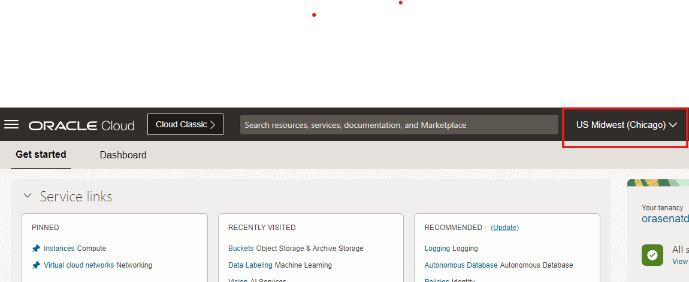
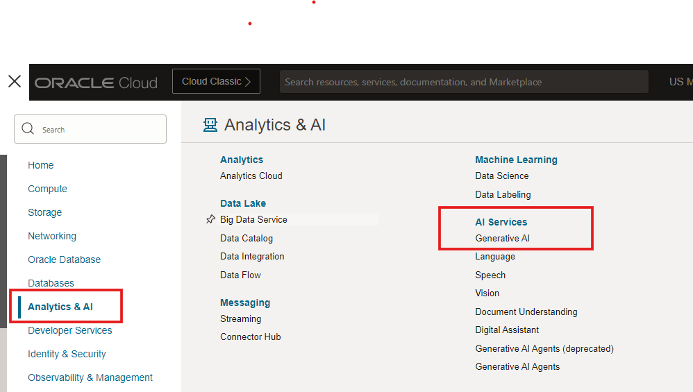

# OCI Generative AI Playground and Trial Generation

## Introduction

OCI Generative AI Playground allows you chat, generate and summarize content and also show numerical vector embeddings for textual data. It is REST API enabled for programmatic access and allows you to tune the outputs of your query based on certain parameters. It currently allows Cohere command R+ and Meta Llama model. In this workshop, all clinical trials data is generated with Cohere command R+ playground. Clinical trial datasets are generated for Cancer, diabetes and liver diseases.

Estimated Lab Time: -- 5 minutes

### Objectives

In this lab, you will:

* Learn how to use OCI Generative AI Playground interactively
* Prompt and generate a few clinical trial documents yourself
* Verify the generated document has no personal information
* Prompt to try out some summarization examples on your text
* View generated API code (Python) code 

### Prerequisites (Optional)

This lab assumes you have:

* An Oracle Cloud account in the Chicago region
* You have completed the required policy setup for this workshop
* You are part of the administrator group in the tenancy

## Task 1: Accessing OCI Generative AI Playground

In this section get familiar with the OCI Generative AI playground console

1. Login to your Oracle cloud tenancy and change your tenancy to US Midwest (chicago)
 

2. From Hamburger menu (top left corner), pull up Analytics & AI --> AI Services --> Generative AI
 

## Task 2: Generate a clinical trial in OCI Generative AI Playground

1. Click on the Generative AI -> Overview -> Playground -> Chat and Run the example "Generate a job description" with the cohere-command-r-16k model
 

2. Copy the following text in the chat window *Generate a clinical trial report on drug evaluation on Advanced Non-Small Cell Lung Cancer* , change the *Maximum output settings* and the *Temperature* settings as shown. Press Submit to generate a clinical trial report.
 

3. Note how the Personal Identifiable Information (PII) is redacted and substituted
 

## Task 3: Generate a summary and view generated code

1. Copy the generated clinical trial to Playground -> Summarization and generate summary.
 

2. Click on the view code button to see the generated code
 

## Learn More

* [OCI Generative AI](https://www.oracle.com/artificial-intelligence/generative-ai/generative-ai-service/)
* [Realize business value by transforming data into action with Generative AI](https://blogs.oracle.com/ai-and-datascience/post/generative-ai-use-cases/)

## Acknowledgements

* **Author** - Rajib Ghosh, Master Principal Cloud Architect, OCI AI and GenAI Center of Excellence
* **Last Updated By/Date** - Aug, 2024
