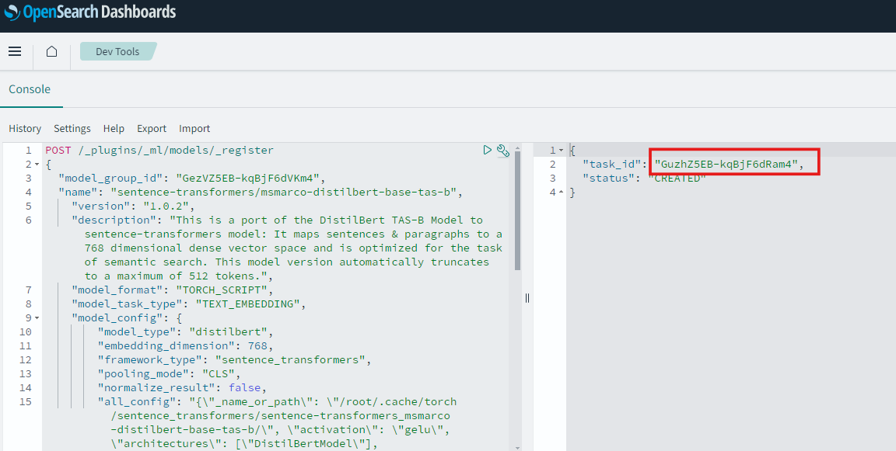
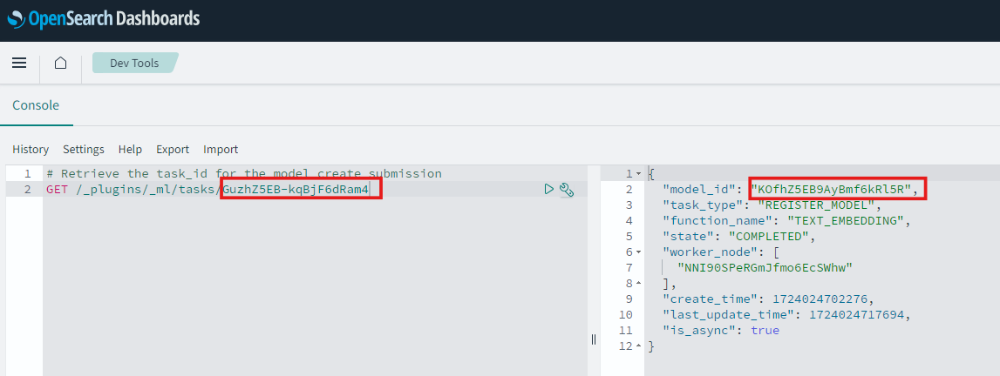

# Evaluating with Opensearch Neural and Hybrid search (Optional)

## Introduction

This is an optional lab, primarily geared for users who are familiar with OCI Opensearch. This lab shows you how to interact with OCI Opensearch console interface and run basic commands such as creating indexes, running queries to view results. It also shows how Machine learning based Neural search can be configured with OCI Opensearch and hybrid search can be run for this workshop

Estimated Lab Time: -- 10 minutes

### Oracle cloud Infrastructure Opensearch

OCI Search with OpenSearch is a fully managed open source service that makes it easy to deploy, operate, and scale OpenSearch on customizable infrastructure. The cloud implementation of indexed search product is suitable for both lexical and neural searches based on AI/ML models. The product features creation of vector embeddings within the product as well as support for external embeddings only as a vector store. It also flexibility in finer model tuning and weight adjustments in a hybrid or combination search scenario. This flexibility along with its managed service capability makes it a good platform for Retrieval Augmented Generation (RAG) implementation for both small or high dimensional indexed searches.

### Objectives

In this lab, you will:

* Access the Opensearch cluster dashboard from your laptop
* Use Opensearch UI tools such as dashboards and Index Management tools
* View clinical trial indexes and indexed data
* Test Opensearch access from OCI Data science environment
* Use Opensearch *dev tools* to create neural search models
* Use ingestion pipelines to create vector embeddings
* Use search pipelines and indexes to perform custom hybrid search (i,e lexical and neural together)

### Prerequisites

This lab assumes you have:

* An Oracle Cloud account with US-Chicago region access
* You have successfully provisioned an OCI Opensearch cluster
* You have familiarity with Opensearch commands (GET/PUT/POST..)
* Some familiarity with using pre-trained ML models is helpful but not required

## Task 1: Login into Opensearch instance and invoke Opensearch UI

1. Create a windows batch or shell script substituting the following as shown below and execute in your laptop to login to SSH tunnel in opensearch instance

```text
ssh -C -v -t -L 127.0.0.1:5601:(Opensearch_dashboard_ip):5601 -L 127.0.0.1:9200:(Opensearch_api_private_ip):9200 opc@(compute instance_public_ip) -i (ssh_key_to_login_to_compute_instance)
```

Refer to the following screenshots for pulling up the above relevant details 
  
  

## Task 2: Create the Opensearch model group

1.Search for an existing clinical-trial model group.

```text
#Search for the clinical trials model group
GET /_plugins/_ml/model_groups/_search
{
  "query": {
    "match": {"name": "Clinical-trials"}
  }
}
```

2.If it does not exist then copy the code below to create it. It should display the model_group_id. Make a note of it

```text
# create a model group 
POST /_plugins/_ml/model_groups/_register
{
  "name": "Clinical-trials",
  "description": "A model group for clinical trials local models"
}
```

3.To test that the model group is created, run code in step 1. The Id field in the output will contain *model_group_id*

4.Use the code below if you need to delete the model group. Note that any models in the group must be deleted first.

```text
# Grab the model_group_id and delete the model group
DELETE _plugins/_ml/model_groups/(model_group_id)
```

## Task 3: Create the Opensearch model

1.Substitute the retrieved *model-group-id* in the code below to create the model. This currently pulls the model from a common object store location for OCI compliance that will expire. However, if you have issues pulling this model or running the code below, you may pull the model directly from hugging face or Opensearch pre-trained model documentation as well.

```text
# Create the model
POST /_plugins/_ml/models/_register
{
  "model_group_id": "(model-group-id)",
  "name": "sentence-transformers/msmarco-distilbert-base-tas-b",
    "version": "1.0.2",
    "description": "This is a port of the DistilBert TAS-B Model to sentence-transformers model: It maps sentences & paragraphs to a 768 dimensional dense vector space and is optimized for the task of semantic search. This model version automatically truncates to a maximum of 512 tokens.",
    "model_format": "TORCH_SCRIPT",
    "model_task_type": "TEXT_EMBEDDING",
    "model_config": {
        "model_type": "distilbert",
        "embedding_dimension": 768,
        "framework_type": "sentence_transformers",
        "pooling_mode": "CLS",
        "normalize_result": false,
        "all_config": "{\"_name_or_path\": \"/root/.cache/torch/sentence_transformers/sentence-transformers_msmarco-distilbert-base-tas-b/\", \"activation\": \"gelu\", \"architectures\": [\"DistilBertModel\"], \"attention_dropout\": 0.1, \"dim\": 768, \"dropout\": 0.1, \"hidden_dim\": 3072, \"initializer_range\": 0.02, \"max_position_embeddings\": 512, \"model_type\": \"distilbert\", \"n_heads\": 12, \"n_layers\": 6, \"pad_token_id\": 0, \"qa_dropout\": 0.1, \"seq_classif_dropout\": 0.2, \"sinusoidal_pos_embds\": false, \"tie_weights_\": true, \"torch_dtype\": \"float32\", \"transformers_version\": \"4.33.2\", \"vocab_size\": 30522}"
    },
    "model_content_size_in_bytes": 266363799,
    "model_content_hash_value": "54ee88869b39f0b7d7cede249409286333d152a49146259d271041fef5d39f03",
    "url_connector": {
        "protocol": "oci_sigv1",
        "parameters": {
            "auth_type": "resource_principal"
        },
        "actions": [
            {
                "method": "GET",
                "action_type": "DOWNLOAD",
                "url": "https://orasenatdpltintegration03.objectstorage.us-chicago-1.oci.customer-oci.com/p/HhDzaubWOjd86EHa5dzxBBDhGF6Wp2h42r97X60Dy8Z-tJRaFeWhslO0e-1n9a2E/n/orasenatdpltintegration03/b/clinical-trials/o/sentence-transformers_msmarco-distilbert-base-tas-b-1.0.2-torch_script.zip"
            }
        ]
    }
}
```

2.Record the *task_id*. Please note that Opensearch *model_id* can be retrieved from the registration *task_id* for the model register job
  

3.Retrieve the *model_id*
  

4.Deploy and verify the model
  
  

5.Test the model embeddings created with a query
  

## Task 4: Using Hybrid search notebook

1. Open up to execute the notebook *demo_hybrid_search.ipynb*. You can enter "Shift+enter* to execute the notebook cells one by one

2. Enter the compartment id and the opensearch credentials
  

3. Enter the recorded *model_id* retrieved from the Task
  

4. Note the weight definitions of the search pipeline and how a combination of a match query and neural search query on description embeddings is used to control the retriever outputs

5. Run the notebook cells and view the retrieval score  
  

6. Reverse the weights in the search pipeline and recreate the pipeline 
  

7. Run your query again to view the results
  

## Task 5: Analyzing search results

1. Validating and comparing hybrid search query results is complex and requires experimentation to find the right combination of weights that work for the data. As you see that top record returned is independent of the weights but the other records are affected and different titles with scores are reported. 

## Learn More

* [Opensearch hybrid search](https://opensearch.org/docs/latest/search-plugins/hybrid-search/#step-4-configure-a-search-pipeline)
* [Search Documents stored in Object Storage using Opensearch, Generative AI, Semantic Search, RAG](https://apexapps.oracle.com/pls/apex/r/dbpm/livelabs/view-workshop?wid=3762)

## Acknowledgements

* **Author** - Rajib Ghosh, Master Principal Cloud Architect, OCI AI and Gen AI Center of Excellence
* **Last Updated By/Date** - Aug 2024

