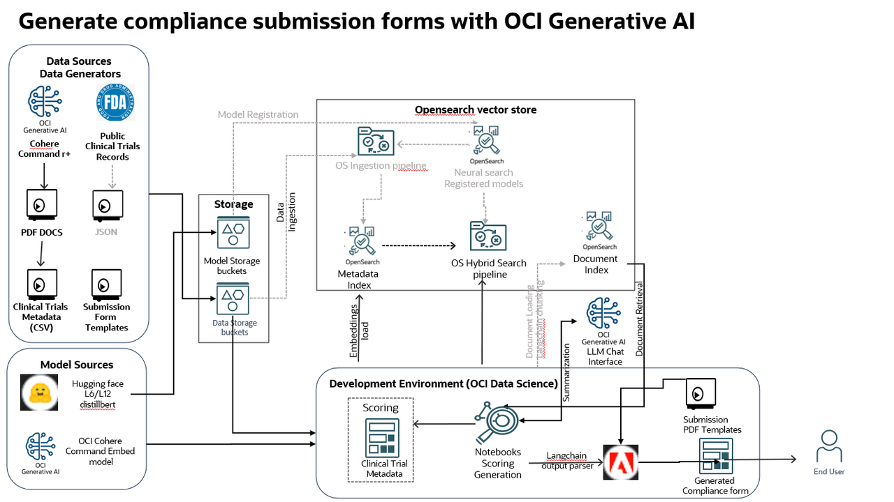

# Introduction

Organizations today are challenged with analyzing large amounts of structured and unstructured data such as tables, invoices, reports for compliance reporting to regulatory authorities accurately.This requires analyzing, filtering and summarizing large volume of textual and tabular data that are typically resident in an enterprise lakehouse, on-premise servers and cloud. Producing form based templated outputs accurately and timely is a huge time consuming task and hence enterprises are looking at AI to resolve this issue

## About this Workshop

In this hands-on lab, we will show how you can auto-generate and fill compliance forms that summarizes information from a pool of  clinical trial PDF documents for submission to regulatory authorities. This lab uses OCI Generative AI services to generate fillable form content from a healthcare organization's clinical trial dataset.

In order to maintain generic nature of the lab and data compliance, all source clinical trial data are auto-generated by OCI Generative AI model such as Cohere Command R+.

Learn more about the architecture, methodology and key automation steps to scale document generation process across your enterprise knowledge bases.

## Task 1: Solution blueprint and Architecture

Key points covering the solution are

* Generic RAG framework with OCI only services
* Support for multiple data sources, embedding options, models and llms
* OCI Gen AI generated clinical trials
* Ability to score and compare various vector embedding functions
* Both open source and OCI gen AI embedding function examples
* OCI Generative AI Cohere chat llm based summarization
* Integration with langchain and output generation
* Support for external & in vector store embedding with OCI Opensearch
* Provision for using Opensearch Hybrid search
* Easy extensibility to OCI AI vector search or to other vector stores

The diagram below shows a comprehensive architecture of the solution blueprint. 

  

## Task 2: Labs

| Lab | Module | Est. Time |
  | --- | --- | --- |
  |   | Getting started | 5 minutes |
  | 1 | Setup OCI Services | 15 minutes  |
  | 2 | Generate clinical trials with OCI Generative AI | 5 minutes |
  | 3 | Developing with OCI Data science | 10 minutes |
  | 4 | Vectorize, load and evaluate | 10 minutes |
  | 5 | Generate Compliance document | 10 minutes |
  | 6 | Using Neural and Hybrid search | 10 minutes |

Total Estimated time: 65 minutes

## Learn More

* [Oracle Generative AI Capabilities](https://www.oracle.com/artificial-intelligence/generative-ai/)
* [Oracle Clinical Digital Assistant](https://www.oracle.com/health/clinical-suite/clinical-digital-assistant/)

## Acknowledgements

* **Author** - Rajib Ghosh, Master Principal Cloud Architect, OCI GenAI Center of excellence
* **Last Updated By/Date** - Aug, 2024
