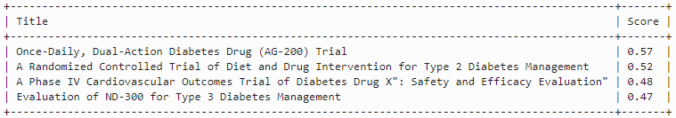
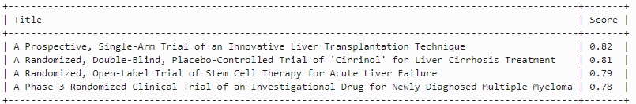

# Vectorize, load and search and evaluate retrieval

## Introduction

This lab focuses on creating vector embeddings with the help of an open source pre-trained as well as OCI Generative AI embedding model. The purpose is to show a comparison of the retrieval search scores between two embedding models. This enables you use this as a test bed to test multiple embedding models and plugin the best possible embedding model best suited for your data in the Retrieval Augmented Generation (RAG) scenario

Estimated Lab Time: -- 10 minutes

### About Embedding models

In this lab, we use a Hugging face pre-trained sentence transformer embedding model all-MiniLM-L6-v2 and Oracle cloud Generative AI Cohere command Embedding model to create vectors store in OCI Opensearch index. Embedding models vary by dimensions and algorithms and are also based of the volume of dataset searched. Retrieval scores can be better based on higher dimensionality of the model. In this lab, you have the option to check embedding dimension of the model you are using.

### Objectives

In this lab, you will:

* Create vector embeddings on textual clinical data
* Create vector embeddings on short (title) and long (description) textual data
* Create vector embeddings with an open source pre-trained model and OCI Generative AI embedding model
* Compare query retrieval scores across various models and various short and long text segments.

### Prerequisites

This lab assumes you have:

* Knowledge of Oracle cloud services
* Some knowledge of OCI Data science and OCI Opensearch
* Programmatic understanding of python
* Some understanding of vector embeddings, Generative AI and Large language models (LLMs)
* Some understanding of the langchain framework

## Task 1: Vectorize, load and query data using open source pre-trained model

1. Get the following information into a notepad or a script

   * Compartment OCID for *clinical-trials* compartment. (Search on OCI console for compartments, click your compartment and copy the OCID)
   * Opensearch username - The username entered while provisioning Opensearch cluster (i,e *osmaster*)
   * Opensearch password - The password entered while provisioning Opensearch cluster
   * API end point Private IP from OCI Opensearch service console

2. Double click to open up the notebook *demo-vector-search-ext.ipynb*. Run each of the cells one by one from top by using *Shift+Enter* or play button at the top

3. Substitute the following definitions in the cell as shown below
 

4. Run the next cell to make sure the Opensearch client connectivity works. It should show the *OpenSearch([{'host': 'hostname', 'port': 9200}])* as outputs

5. Create vector embeddings with the Open source pre-trained model *all-minilm-l6-v2* and load them with the corresponding texts into an index *idx-all-minilm-l6-v2* . Note that vector embeddings are created by the model on the clinical-trial metadata file *clinical-trial-titles.csv* that contains the Filename, Title and Descriptions only

6. In the next few cells, you can execute your queries against Title and Descriptions embeddings in Opensearch index and retrieve the scores.

## Task 2: Vectorize, load and query data using OCI Generative AI

1. Run the remaining cells from the section highlighting **Vector embeddings and search with OCI Generative AI**

2. Create the corresponding index and retrieve scores on vector searches based on OCI Generative AI embeddings

## Task 3: Compare retrieval scores

Retriever scores are an indication of how accurately the embedding model can pull up query results based on the query texts.

1. The following shows a retriever score comparison between the *all-minilm-l6-v2* and OCI Generative AI *cohere.embed-english-v3.0* model

   * 
   * 

## Task 4: Testing to find the best retrievers (RAG) for your data

1. Some notable points to observe
   * How the selected model is used for query embedding in the notebook
   * Search can be performed on short text embeddings (i,e Title) or long texts (i,e Descriptions)
   * Different sentence transformer models can be chosen and their scores can be evaluated
   * Change the *num_titles* parameter to configure the top *n* documents by score
   * Increase Text Description length or context to see how scores change
   * Increase volume of clinical-trials metadata in the *clinical-trial-titles.csv* data

2. You can then test to find the embedding model that works best for your data

## Learn More

* [OpenSearch provided pre-trained models](https://opensearch.org/docs/latest/ml-commons-plugin/pretrained-models/)
* [Conversational Search with OCI Generative AI](https://docs.oracle.com/en-us/iaas/Content/search-opensearch/Concepts/ocigenaiconnector.htm)

## Acknowledgements

* **Author** - Rajib Ghosh, Master Principal Cloud Architect, OCI AI and Gen AI Center of Excellence
* **Last Updated By/Date** - Aug 2024
