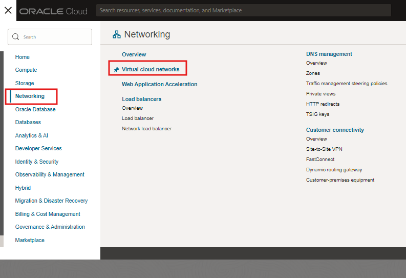
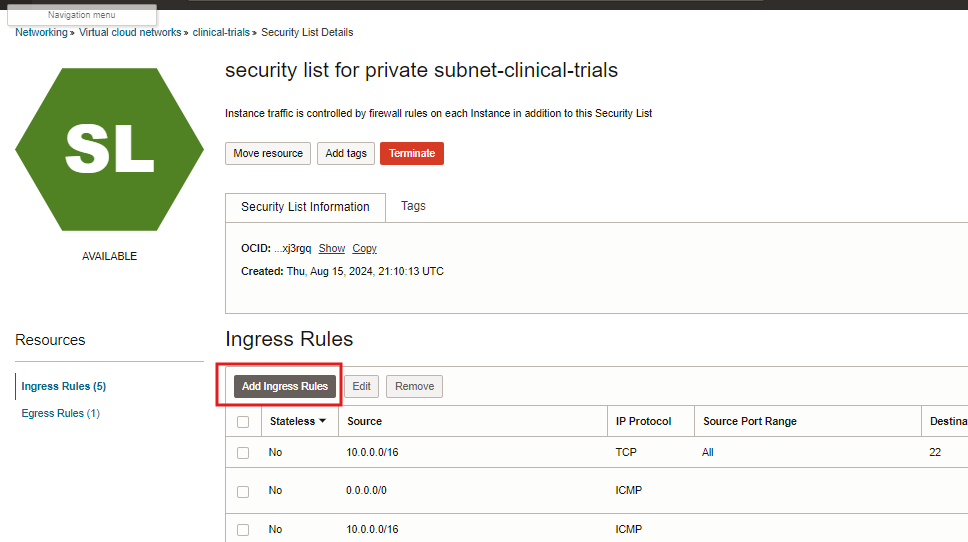
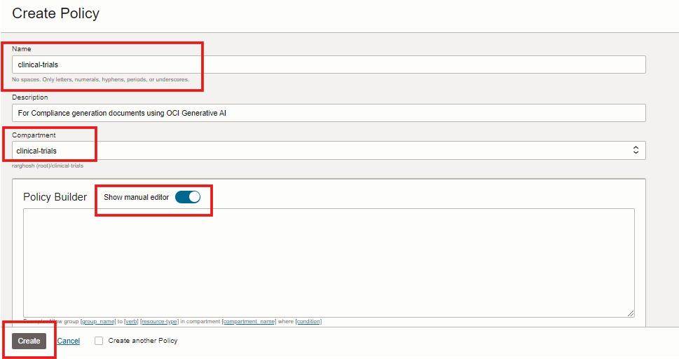
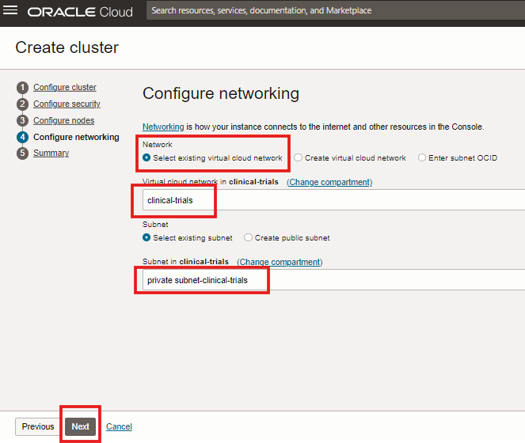
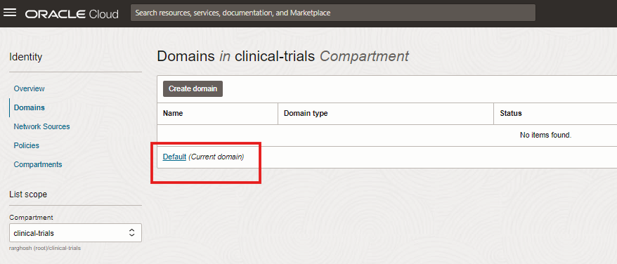
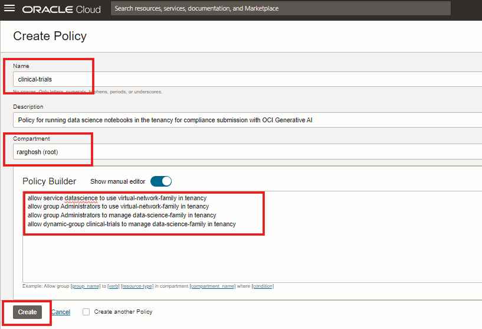
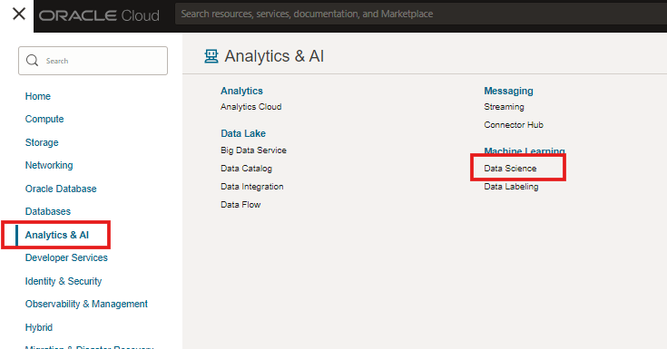

# LAB-0: Setting up the environment

## Introduction

In this lab, we perform setting the Oracle cloud environment for running the workshop successfully.

Estimated Lab Time: -- 15 minutes

### Objectives

In this lab, you will:

* Create a Oracle cloud free-tier tenancy and login to verify
* Set up the workshop compartment
* Set up required OCI Networking components
* Set up OCI object storage buckets
* Set up OCI Compute instance
* Set up OCI Opensearch Service
* Set up OCI Data science service

### Prerequisites

This lab assumes you have:

* An Oracle Cloud account with administrative access
* Some knowledge of working in a cloud environment
* Some familiarity with cloud services, access methods

### Recommendations

This workshop uses the name ***clinical-trials*** for most of the objects in the workshop for ease of reference. Some recommendations -

1. Use ***clinical-trials*** for naming all cloud resources
2. Use same password for accessing all cloud resources
3. NOTE: This is a recommendation for easy working through the workshop.

*This is the "fold" - below items are collapsed by default*

## Task 1: Create an Oracle cloud free-tier tenancy and Login to verify

1. Browse to [Oracle cloud Free Tier](https://www.oracle.com/cloud/free/)
  
2. Enter your name, email address and validate you are human
3. Create your Oracle cloud free-tier account
4. Download [Oracle Mobile Authenticator App](https://docs.oracle.com/en-us/iaas/Content/Identity/mobileauthapp/download-mobile-authenticator-app.htm)
5. Please follow this page if you need to [Register the OCI authenticator](https://docs.oracle.com/en-us/iaas/Content/Identity/mobileauthapp/registering_mobile_devices_with_oma.htm)
6. Please NOTE that you MUST use us-midwest-Chicago as your Home Region
  
7. Note down your Oracle cloud tenancy name
8. Note down your sign-in id (your email) and password
9. [Login to your Oracle cloud tenancy](cloud.oracle.com)
 
10. Upon successful login, your screen should look like
  

## Task 2: Setup compartment

1. Pull down the Oracle cloud hamburger menu and search for compartments
 
2. Create the compartment called clinical-trials under the root compartment. Verify it is successfully created as shown below
 
 

## Task 3: Setup OCI Networking components

1. Setup a virtual cloud network (VCN) called "clinical-trials" in the clinical-trials compartment with the help of VCN wizard as shown below

 
 
 
 
 
 
 

 2. Add two security list ingress entry to the private subnet of the clinical-trials VCN for ports 9200 and 5601 for Opensearch access

 
 
 
 
 
 
 
 

## Task 4: Set up OCI Object storage buckets

1. Setup an object storage bucket in the clinical-trials compartment as shown below
 
 
 

## Task 4: Set up an OCI Compute instance

1. Setup an OCI compute instance "clinical-trials" in the clinical-trials compartment. This is required for tunneling into the OCI Opensearch instance quickly from your laptop.

 
 

2. Generate a new SSH key pair and download both the private and public key pair to your laptop. You will need this to SSH login to the compute instance

 

3. Make sure that the compute instance is provisioned and is running.

 

## Task 5: Set up an OCI Opensearch service

This involves setting up OCI Opensearch policies and creating an Opensearch instance. Please note that it can take up to 10 minutes to provision an Opensearch service instance

1. Setup OCI Opensearch policy "clinical-trials" in the "clinical_trials" compartment as shown below

 
 

2. Issue the following code in the policy builder manual editor below and hit create

```
allow group SearchOpenSearchAdmins to manage vnics in compartment clinical-trials
allow group SearchOpenSearchAdmins to manage vcns in compartment clinical-trials
allow group SearchOpenSearchAdmins to manage subnets in compartment clinical-trials
allow group SearchOpenSearchAdmins to manage network-security-groups in compartment clinical-trials
allow group SearchOpenSearchAdmins to manage opensearch-family in compartment clinical-trials
allow group SearchOpenSearchAdmins to manage vnics in compartment clinical-trials
```

 

3. Create the Opensearch cluster clinical-trials in the clinical-trials compartment
 
 
 
 

4. Enter **osmaster** as the user and your preferred common password. Create the cluster with all the default options as shown below

 
 
 
 
 
 

5. Note down the API endpoint , Private IP , Opensearch Dashboard API endpoint and Dashboard Private IP for later usage

## Task 5: Set up the OCI Data science service policies

Setup the OCI Data science managed service for running the core part of this workshop. This constitutes setting up

1. Setting up OCI Data science required policies. View the required pre-requisites for setting up the OCI Data science service

2. Locate the Data science policies as shown. You will be eventually creating the Data science service im the clinical-trials compartment. However, the Data science policies called clinical-trials need to be created in the root compartment.

 
 

3. Create a dynamic group for Data science as shown below. The dynamic group provides easier and secure authenticated run-time access to OCI resources during the execution of a data science session

 
 
 
 
 

4. Setup a policy called *clinical-trials* in the **root** compartment of the tenancy as shown below

 
 

5. Use the following policy statements and hit create

```
allow service datascience to use virtual-network-family in tenancy
allow group Administrators to use virtual-network-family in tenancy
allow group Administrators to manage data-science-family in tenancy
allow dynamic-group clinical-trials to manage data-science-family in tenancy
allow group Administrators to manage generative-ai-family in tenancy
```

 

## Task 6: Set up an OCI Data science service project

1. Setup an OCI Data science project.

 
 
 

## Task 7: Set up an OCI Data science Notebook session

1. In this task, create a notebook session called *clinical-trials* with the compute CPU and memory specifications as shown below. Make sure that you select the *Custom Networking* option with a "private subnet* for the build.

 
 

2. Use a minimum compute shape of 4oCPU and 64GB of memory from a CPU based shape such as VM.Standard.E4.Flex

 
 
 

2. You should be able to login to the data science environment and view the Jupyter Lab notebook session.

 

## Learn More


* [OCI pensearch setup](https://apexapps.oracle.com/pls/apex/r/dbpm/livelabs/view-workshop?wid=3427)
* [OCI Data science setup](https://docs.oracle.com/en-us/iaas/data-science/data-science-tutorial/get-started.htm)

## Acknowledgements

* **Author** - Rajib Ghosh, Master Principal Cloud Architect, OCI AI and Gen AI Center of Excellence
* **Last Updated By/Date** - Aug 2024
