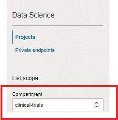

# OCI Data Science setup

## Introduction

In this lab, we will setup the OCI Data science environment necessary for developing code, API calls, customization and automation for generation of compliance documents

Estimated Lab Time: -- 10 minutes

### Oracle cloud Data science

OCI Data science is a managed Python based Jupyter lab based notebook development environment for developing and deploying Machine learning and AI models including Generative AI services. The service supports both CPU and GPU infrastructure, has access to OCI lakehouse storage and processes like Object store, Autonomous database as well as Data flow, catalog and other services.  

### Objectives

In this lab, you will:

* Use OCI Data science console to create a project and notebook session.
* Learn to deploy connectivity with OCI Object store
* Find and deploy a pre-built langchain based conda environment
* Test out connectivity to OCI Generative AI services
* Download and install libraries required for generation

### Prerequisites

*List the prerequisites for this lab using the format below. Fill in whatever knowledge, accounts, etc. is necessary to complete the lab. Do NOT list each previous lab as a prerequisite.*

This lab assumes you have:

* An Oracle Cloud account with admin privileges in the Chicago region
* Required Networking setup (i,e VCN and subnets) for provisioning the data science environment
* Required Data science policies deployed successfully.
* Required service limits to provision a CPU shape
* A compartment (i,e clinical-trials or any preferred name) be created to host Data science services

*This is the "fold" - below items are collapsed by default*

## Task 1: Create data science project and notebook session

In this section, we will create an OCI Data science project and a notebook session environment for python based development with an appropriate compute shape.

1.Navigate to OCI Data science and switch to the compartment you have created

 
  

2.Create a Data science project in your compartment

  

3.Create a Notebook session

Create a notebook session with the specification as marked.
  
Create the networking configuration as "Custom networking" and enter the VCN and the subnet name you have created before for this purpose.
 
 Click the Create button to initiate the notebook session creation. *NOTE: This can take a few minutes to provision and the status to come in an Active state*.

4.Open and login to the notebook session
 

4. Example with inline navigation icon  click **Navigation**.

5. Example with bold **text**.

   If you add another paragraph, add 3 spaces before the line.

## Task 2: Setup conda environment with langchain

1. From the Launcher (File-->New Launcher if needed), click on the Environment explorer to view the list of conda environments
  

2. Filter the conda environment to view the ones containing the langchain libraries and select the one marked below
  

3. Copy the command command below to run in a terminal session

  
4. Open up a Terminal session as shown from the Launcher
  
5. Paste and run the *odsc..* command as shown. It would take a few minutes to install pytorch21_p39_gpu_v1 conda environment. Make sure it is successfully completed and installed.
  

## Task 3: Setup required libraries
1. Click on the conda/notebooks folder on left pane
  
2. Create an empty notebook file as shown
  
3. Change to the pytorch21_p39_gpu_v1 you have just installed
  
4. Install the pip libraries as shown below in the cell one by one. You may have some errors while installing the opensearch-py library, but it is ok to ignore it and does not affect any libraries used in this workshop. Press Shift+Enter to execute the cell.
  
5. Comment the *pip install <library>* texts in the notebook cell as shown below
  

## Task 4: Create the required directories 
From the notebook session terminal window, create the following additional directories 
```
mkdir ~/conda/data
mkdir ~/conda/data/pdfs
mkdir ~/conda/data/templates
mkdir ~/conda/data/outputs
```

## Task 5: Copy required workshop notebook files
1. Download the following notebook files to your laptop and upload it 
  
  
  
  
2. Upload these files to the notebook session environment in ~/conda/notebooks folder
  

## Task 6: Copy workshop source data files

3. Similarly copy the clinical trials source data files into the notebook session

The OCI Data science environment for this workshop is now ready

  Use tables sparingly:

  | Column 1 | Column 2 | Column 3 |
  | --- | --- | --- |
  | 1 | Some text or a link | More text  |
  | 2 |Some text or a link | More text |
  | 3 | Some text or a link | More text |

2. You can also include bulleted lists - make sure to indent 4 spaces:

    * List item 1
    * List item 2

3. Code examples

    ```
    Adding code examples
   Indentation is important for the code example to appear inside the step
    Multiple lines of code
   <copy>Enclose the text you want to copy in <copy></copy>.</copy>
    ```

4. Code examples that include variables

 ```

  <copy>ssh -i <ssh-key-file></copy>

  ```

## Learn More

*(optional - include links to docs, white papers, blogs, etc)*

* [URL text 1](http://docs.oracle.com)
* [URL text 2](http://docs.oracle.com)

## Acknowledgements

* **Author** - <Name, Title, Group>
* **Contributors** -  <Name, Group> -- optional
* **Last Updated By/Date** - <Name, Month Year>
