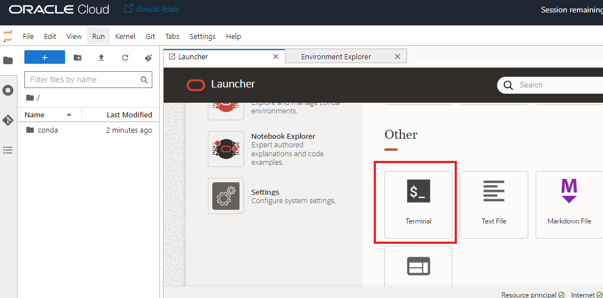
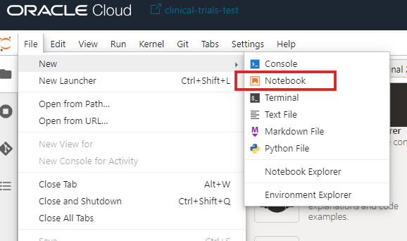
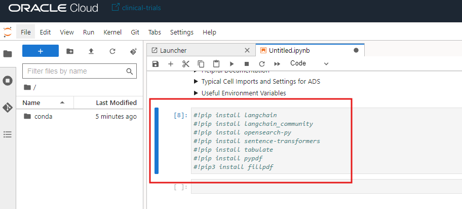
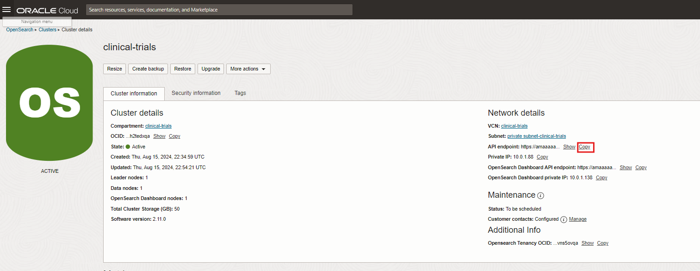
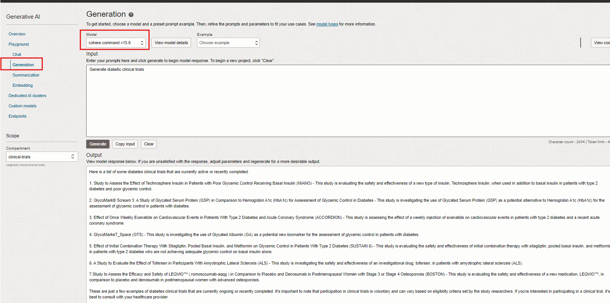

# OCI Data Science setup

## Introduction

In this lab, we will setup the OCI Data science environment necessary for developing code, API calls, customization and automation for generation of compliance documents

Estimated Lab Time: -- 10 minutes

### Oracle cloud Data science

OCI Data science is a managed Python based Jupyter lab based notebook development environment for developing and deploying Machine learning and AI models including Generative AI services. The service supports both CPU and GPU infrastructure, has access to OCI lakehouse storage and processes like Object store, Autonomous database as well as Data flow, catalog and other services.  

### Objectives

In this lab, you will:

* Deploy a pre-built langchain based conda environment
* Test connectivity to OCI Generative AI services
* Test connectivity with OCI Opensearch services
* Deploy OCI CLI connectivity with OCI Object store
* Download and install required pip libraries
* Install Compliance Document Generation Notebooks

### Prerequisites

This lab assumes you have:

* An Oracle Cloud account with admin privileges in the Chicago region
* A running Data science notebook session environment
* A running OCI Opensearch service

*This is the "fold" - below items are collapsed by default*

## Task 1: Deploy a pre-built langchain conda environment

1. From the Launcher (File-->New Launcher if needed), click on the Environment explorer to view the list of conda environments
  

2. Filter the conda environment to view the ones containing the langchain libraries and select the one marked below

  

3. Copy the command command below to run in a terminal session

  

4. Open up a Terminal session as shown from the Launcher

  

5. Paste and run the ***odsc conda install -s pytorch21_p39_gpu_v1*** command as shown. It may take a few minutes to install the conda environment. Make sure it is successfully completed and installed as shown

  

## Task 2: Download and install required pip libraries

1. Locate the notebooks in the /home/datascience/conda directory. This directory will be used for creating and running all notebooks for the workshop

  

2. Create a new notebook
  

3. Change the kernel to the installed conda environment

  

4. Copy and execute to install the pip libraries as shown below in the notebook cell. Press *Shift+Enter* to execute the notebook cell

```
!pip install langchain
!pip install langchain_community
!pip install opensearch-py
!pip install sentence-transformers
!pip install tabulate
!pip install pypdf
!pip install fillpdf
```

  

5. It is possible that some of the libraries are pre-installed in the environment. Ignore if that is so. You may also have incompatibilities with other libraries in the pre-built conda. You may ignore them if that occurs. Comment them as shown below

  

## Task 3: Install Workshop Compliance Document Generation code

1. Download  and upload to the home directory /home/datascience in the notebook session as shown below 

  

2. Open up a terminal session and run *unzip conda.zip* as shown below.

  

## Task 4: Test connectivity with OCI Opensearch services

1. Copy the Opensearch API URL from the console
  

2. Change to *cd /home/datascience/conda/scripts* directory in a data science terminal window and run. Sucecssful connection should display the json as shown below
```
curl -k -u <os_userid>:<os_password> <os_api_endpoint>:9200
```

  

## Task 6: Configure OCI CLI Connectivity to Object store and Generative AI

1. Get your user OCID and your Tenancy ID from console as shown below
  
  
  

2. Open up a terminal window and enter *oci os ns get*. Enter values as follows
```
Do you want to create a new config file ? Y
Create logging through a browser? n
Location of your config: Enter
Enter user OCID : <copied from console in previous step>
Enter Tenancy OCID : <copied from console in previous step>
Region by index or name : us-chicago-1
Do you want to generate a new RSA key pair? Y
Enter directory for keys created : Enter
Enter name of your key : Enter
Enter passphrase: N/A
Re-enter passphrase : N/A
```

  
    

3. Move and download your generated public key pem file

  

4. Upload the downloaded public API key to OCI Console  

  
  
  

5. Test out the OCI CLI access after from Data science notebook session.

  

## Task 5: Test connectivity to OCI Generative AI services

1. Open up the Generative AI Generation Interface for API code testing. Please note that the *command r* chat interface is not OCI API enabled as of yet and is not required for this workshop. 

  

2. Generate a query and click on the *View Code* button and select *python* as the Language

  

3. Copy the generated code to a notebook cell. You should be able to generate output as shown below

  

## Learn More

*(optional - include links to docs, white papers, blogs, etc)* 

* [URL text 1](http://docs.oracle.com)
* [URL text 2](http://docs.oracle.com)

## Acknowledgements

* **Author** - Rajib Ghosh, Master Principal Cloud Architect, OCI AI and Gen AI Center of Excellence
* **Last Updated By/Date** - Aug 2024
