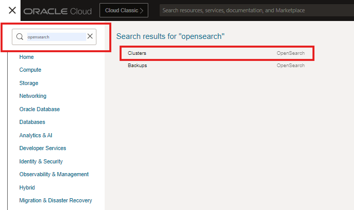
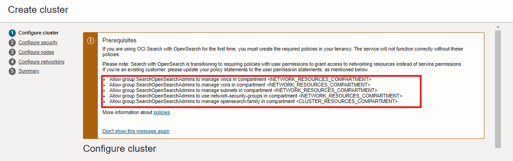
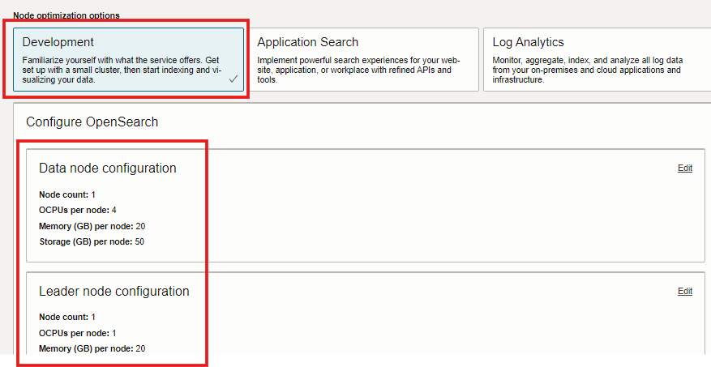
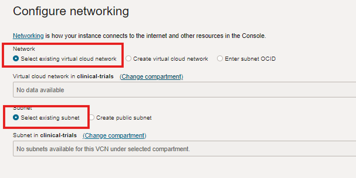

# Title of the Lab

## Introduction

In this lab, we will setup the Oracle cloud Opensearch service that is used as a vector store to support ML model based vector searches on custom datasets. Opensearch features are only restricted to the features that are required for the workshop. However, user familiarity with OCI Opensearch or its cloud or open source implementation is a plus.

Estimated Lab Time: -- 10 minutes

### Oracle cloud Infrastructure Opensearch

OCI Search with OpenSearch is a fully managed open source service that makes it easy to deploy, operate, and scale OpenSearch on customizable infrastructure. The cloud implementation of indexed search product is suitable for both lexical and neural searches based on AI/ML models. The product features creation of vector embeddings within the product as well as support for external embeddings only as a vector store. This flexibility along with its managed service capability makes it a good platform for Retrieval Augmented Generation (RAG) implementation for large language models (LLMs) such as Oracle Generative AI.

### Objectives

*List objectives for this lab using the format below*

In this lab, you will:

* Provision an OCI Opensearch cluster in cloud
* Access the cluster dashboard from your laptop
* Access the Opensearch UI such as dashboards and dev tools
* Test Opensearch access from OCI Data science environment

### Prerequisites

This lab assumes you have:

* An Oracle Cloud account with US-Chicago region access
* You have successfully provisioned an OCI Opensearch cluster
* Related networking resources (i,e VCN, subnets) are already created. 
* Familiarity with OCI Opensearch is helpful but not required.

*This is the "fold" - below items are collapsed by default*

## Task 1: Provisioning OCI Opensearch cluster

If not already done in your tenancy, provision an OCI Opensearch cluster using the default settings as shown below

1. Bring up Opensearch service by searching the OCI Services search as shown

 

2. Apply all the policies by substituting your network compartment name and the cluster compartment (i,e clinical_trials)
 

3. Name the cluster (i,e clinical-trials), take the default version of 2.11.0 and enter a valid email address
 

4. Select the default values (i,e Development option) and the default configuration for Data node, Leader node and Configure dashboards
 
 

5. Select your existing VCN (i,e clinical-trials) and enter the value of the private subnet in the VCN. Please note that this service should not be configured with the public subnet.Intitate creation of the cluster.
 

4. Once the cluster is created, make a note of the API endpoint, Private IP, Opensearch Dashboard API Endpoint and Opensearch Dashboard Private IP. You will need to login from your local laptop and OCI Data science environment with these credentials
 

## Task 2: Accessing the cluster from local laptop

In order to access the Opensearch cluster through the Opensearch dashboard, an easy and effective method is to create a Linux compute instance in the public subnet of your VCN, SSH port forwarding from your laptop to the VM to the opensearch cluster dashboard and API IP addresses with the private SSH key. An example SSH script that can be run from either Mac or Windows powershell is included here

1. Create a OCI compute instance, configured with your SSH key in the clinical-trials compartment and clinical-trials VCN and corresponding public subnet

2. Run the following command in a shell script (Mac) or windows powershell/batch script
```
# Test opensearch connection from external local laptop
ssh -C -v -t -L localhost:5601:<Opensearch dashboard IP >:5601 -L localhost:9200:<Opensearch API IP>:9200 opc@<compute VM public IP> -i <SSH Private key>
```

3. Connect to Opensearch dashboard as shown below
 

4. Some OpenSearch commands of relevance (below)
  
  **View Indexes** - use Index Management--> Indices.
  
  **Opensearch UI Interaction** - use dev tools or POSTMAN
  
  **View Indexed data** - Create an index pattern from the dashboard management --> Index pattern with the same name as the Index name and view indexed data through Discover men

## Task 3: Accessing the cluster from OCI Data science

With the data science environment configured in the same clinical-trials VCN and same private subnet as the Opensearch cluster, it can be accessed easily without any networking configuration. You only need to copy the Opensearch API Endpoint from the OCI console
```
curl -k -u <os_user>:<os_pass> <Opensearch API Endpoint>
```
Successful connection should show
 


1. Execute the following shell script in an OCI Data science notebook session environment to test opensearch connectivity

  

4. Example with inline navigation icon  click **Navigation**.

5. Example with bold **text**.

   If you add another paragraph, add 3 spaces before the line.

## Task 2: Concise Task Description

1. Step 1 - tables sample

  Use tables sparingly:

  | Column 1 | Column 2 | Column 3 |
  | --- | --- | --- |
  | 1 | Some text or a link | More text  |
  | 2 |Some text or a link | More text |
  | 3 | Some text or a link | More text |

2. You can also include bulleted lists - make sure to indent 4 spaces:

    * List item 1
    * List item 2

3. Code examples

    ```
    Adding code examples
   Indentation is important for the code example to appear inside the step
    Multiple lines of code
   <copy>Enclose the text you want to copy in <copy></copy>.</copy>
    ```

4. Code examples that include variables

 ```

  <copy>ssh -i <ssh-key-file></copy>

  ```

## Learn More

*(optional - include links to docs, white papers, blogs, etc)*

* [URL text 1](http://docs.oracle.com)
* [URL text 2](http://docs.oracle.com)

## Acknowledgements
* **Author** - <Name, Title, Group>
* **Contributors** -  <Name, Group> -- optional
* **Last Updated By/Date** - <Name, Month Year>
