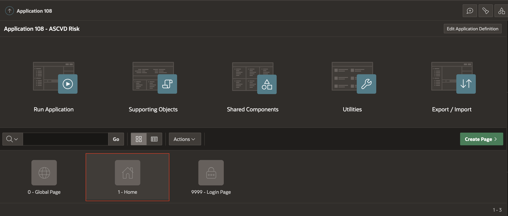
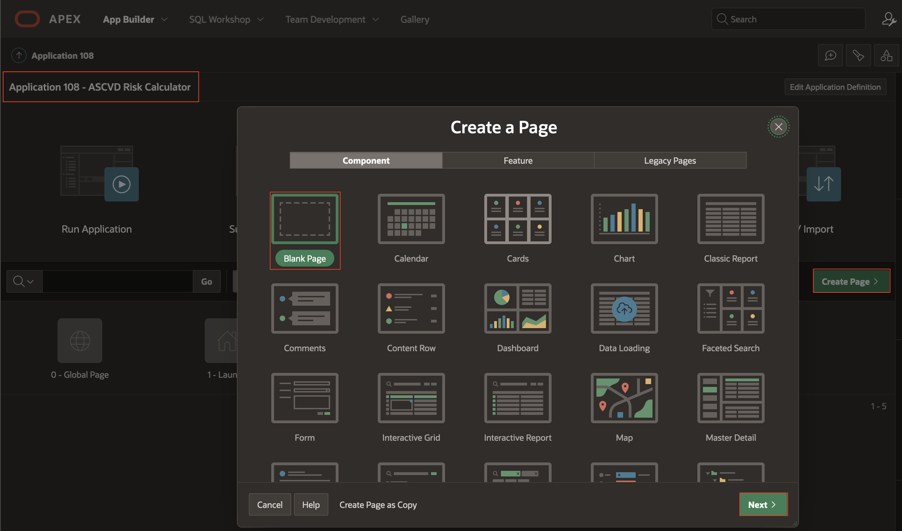
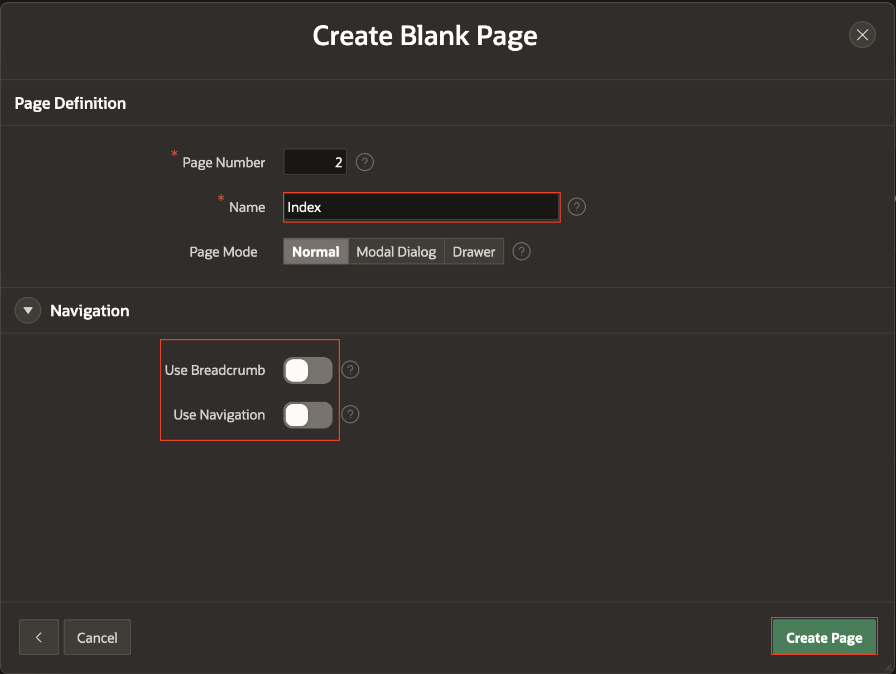
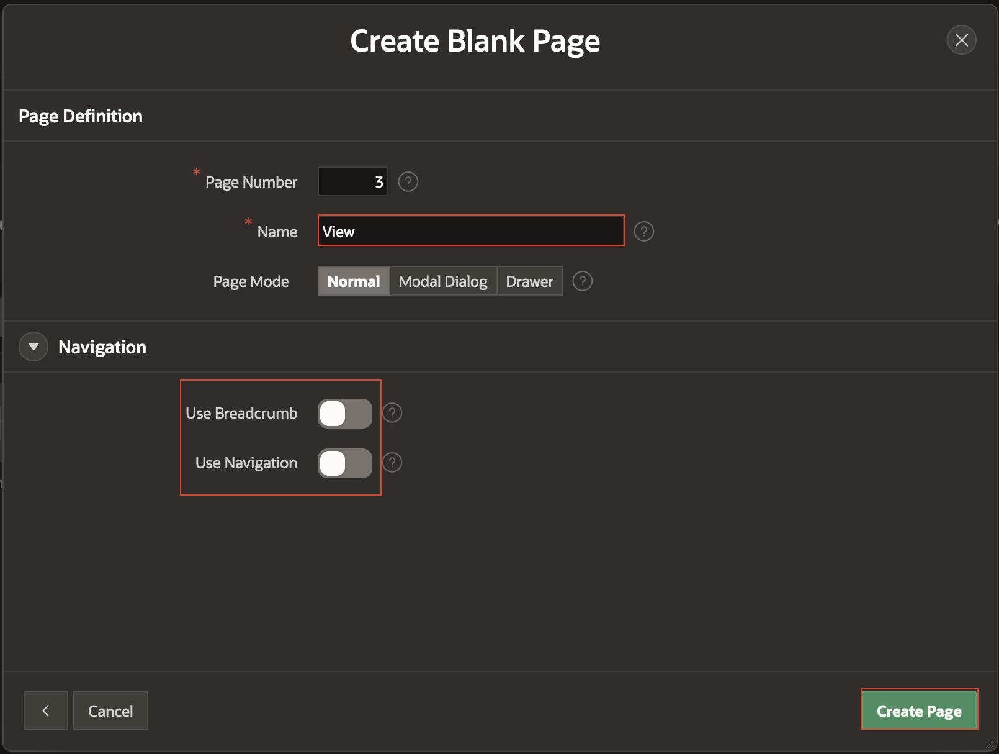

# APEX Application Setup

## Introduction

This lab walks you through creation and initial setup of Oracle APEX application.

Estimated Time: 5 minutes

### Objectives

In this lab, you will:

* Create a new Oracle APEX Application
* Create Oracle APEX Pages

### Prerequisites

This lab assumes you have:

* An Oracle Cloud account or Free Workspace in apex.oracle.com
* All previous labs successfully completed

## Task 1: Create the Application

1. In the App Builder toolbar, click **App Builder**, and click **Create**.

    

2. On the Create Application page, click **New Application**.

    

3. On the Create an Application page, for Name, enter **ASCVD Risk Calculator**.

    Click **Create Application**.

    

## Task 2: Launch Page

1. Return to the Application Home Page.

   Click Home Page..

   

2. Rename Home Page to Launch Page.

    

3. Change page security.

    

## Task 3: Use the Create Page Wizard

1. Return to the Application Home Page.

   Click Create Page..

   On the Create a Page dialog, click **Blank Page**.

   

2. Create Index Page by clicking on **Create** button.

   

3. Repeat the process for the View Page

   

## Learn More

* [APEX on Autonomous](https://apex.oracle.com/en/platform/apex-oracle-cloud/)
* [APEX Collateral](https://apex.oracle.com/en/)
* [Tutorials](https://apex.oracle.com/en/learn/tutorials/)
* [Community](hhttps://apex.oracle.com/community)
* [External Site + Slack](http://apex.world/)

## Acknowledgements

* **Author** - Alexandru Basarab, Senior Software Engineer, Open Platform

* **Contributors** - Mircea Iordache, Software Engineer, Open Platform

* **Last Updated By/Date** - Basarab Alexandru, July 2023
