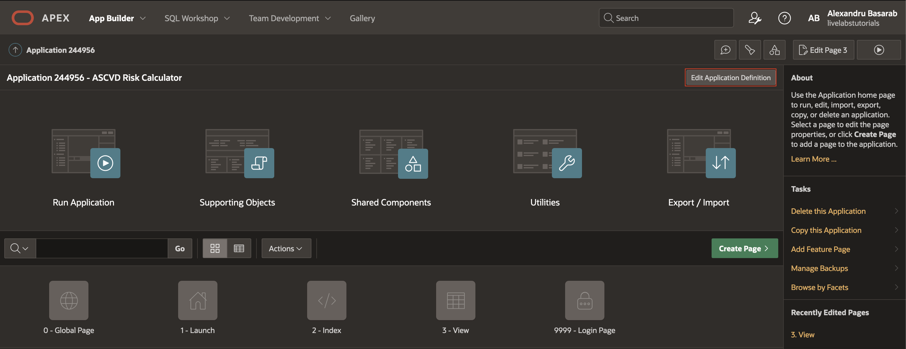

# APEX Application Setup

## Introduction

This lab walks you through creation and initial setup of Oracle APEX application. You will create an new Oracle APEX application and three pages. Two of the pages (Launch, Index) will handle authentications and authorization in SMART on FHIR and the third one (View) will contain the application objects and logic.

Estimated Time: 10 minutes

### Objectives

In this lab, you will:

* Create a new Oracle APEX Application
* Create Oracle APEX Pages

### Prerequisites

This lab assumes you have:

* An Oracle Cloud account or Free Workspace in apex.oracle.com
* All previous labs successfully completed

## Task 1: Create the Application

1. If you have not already logged into your Oracle APEX workspace, sign in using the workspace name, email, and password you signed up with.

   

2. In the App Builder toolbar, click **App Builder**, and click **Create**.

    

3. On the Create Application page, click **New Application**.

    

4. On the Create an Application page, for Name, enter **ASCVD Risk Calculator**, in the Appearance, you can change it to **Redwood Light** or leave it as it is and change it later in lab five.  
    *Note: the icon is random each time you create a new application.*

    Click **Create Application**, and wait a few seconds for the application to be created.

    

## Task 2: Launch Page

1. Return to the Application **Home Page**.

   Click **Home Page**.

   

2. Move **Layout** tab by dragging the tab to the right panel and move the **Page** tab to the middle panel, this way you will always see the attributes of what you are editing in the middle panel.

    *Note: All tabs can be moved, but keep in mind that the workshop uses this layout.*

    

3. Select the page and open page attributes, rename Home Page to **Launch** Page under Identification and change the page **Alias**.

    **Identification > Name:** Launch

    **Identification > Alias:** launch

    

4. Look for Security tab and change Authentication to be a **Public Page** and Page Access Protection as **Unrestricted**, and then **Save** the Page.

    

## Task 3: Use the Create Page Wizard

1. Return to the Application **Home Page** by pressing the application id in the top left corner.

   Click **Create Page**..

   On the Create a Page dialog, click **Blank Page** and press **Next**.

   

2. In the Create Blank Page dialog make sure you uncheck **Use Breadcrumb** and **Use Navigation**, name the page **Index** and then click on **Create** button.

   

3. Change Authentication to **Page is Public**, Page Access Protection to **Unrestricted**. Those settings are available in the page security tab, you will need to scroll down.

    

4. Repeat the process of step one and two and create a new blank page with the name **View**.  
   *Note: Don't forget to uncheck Use Breadcrumb and Use Navigation.*

   

5. Change page security authentication to **Public Page** and page access protection to **Unrestricted**, and then **Save** the Page.

    

## Task 4: Change application home page

1. Click on application id to return to application overview.

    *Note: Your application id will be different.*

    

2. Click on **Edit Application Definition** button in the top right corner of the the overview page.

    

3. Note down your **Application Alias**, can be found in **Definition** section **Name** tab.

    

    **Note: You will need the application alias later on in the workshop to register the app in Code Console.**

4. Click on **User Interface** and under **Attributes** change **Home URL** and **Login URL** to point to **View Page**, use the below URL and then press **Apply Changes** to save.

    **URL:** `f?p=&APP_ID.:VIEW:&APP_SESSION.::&DEBUG.:::`

    

5. Before going forward, note down your workspace, this can be found by clicking on your **Account** in right corner and search for **WORKSPACE**.

    

    **Note: You will need the workspace alias later on in the workshop to register the app in Code Console.**

6. You can keep opened Oracle APEX Workspace in your browser or close it but remember to note or bookmark it.

## Acknowledgements

* **Author** - Alexandru Basarab, Software Development Manager, OHAI - Platform Initiatives

* **Contributors**
    * Mircea Iordache, Software Engineer, OHAI - Platform Initiatives
    * Tudor Dragomir, Software Engineer, OHAI - Platform Initiatives
    * Ionut Balan, Software Engineer, OHAI - Platform Initiatives

* **Last Updated By/Date** - Basarab Alexandru, August 2023
