# Sign Up for Code Console

## Introduction

This lab walks you through the steps to sign up for Code Console, register a new application and configure the ASCVD Risk Calculator APEX app.

Estimated Time: 15 minutes

### Objectives

In this lab, you will:

- Sign Up for Code Console
- Register a new application

### Prerequisites

This lab assumes you have:

- An Oracle Cloud account
- All previous labs successfully completed

## Task 1: Sign Up for Code Console

1. Go to [https://code-console.cerner.com/](https://code-console.cerner.com/). You should see the following page:

   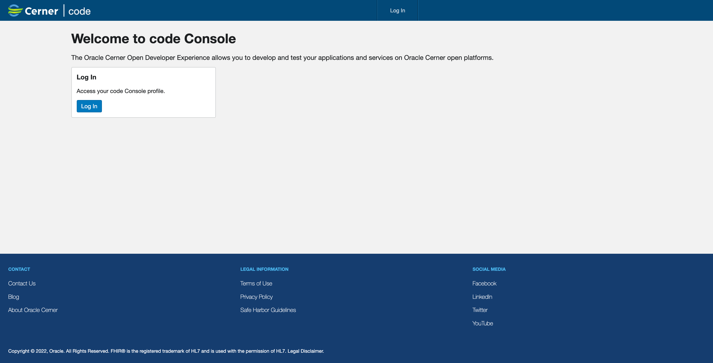

2. Click **Log In** on the main page or in the header.

   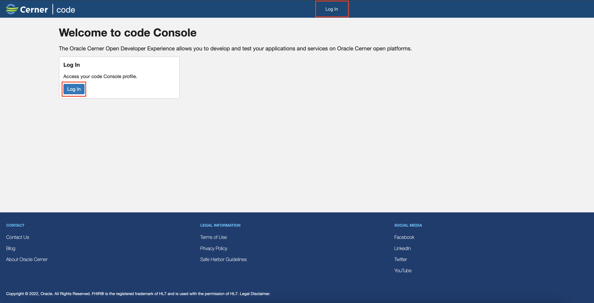

3. Confirm you are on the following page:

   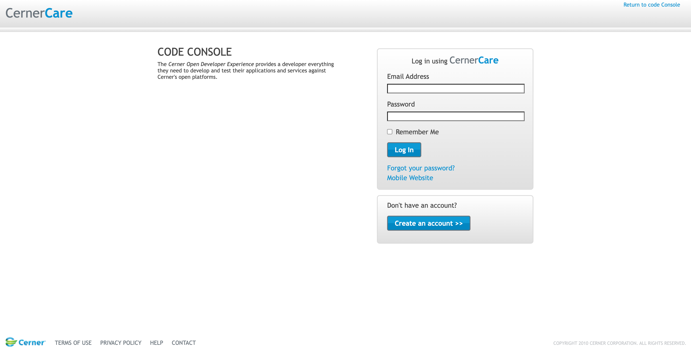

4. If you don’t already have a CernerCare account, click **Create an Account**.

   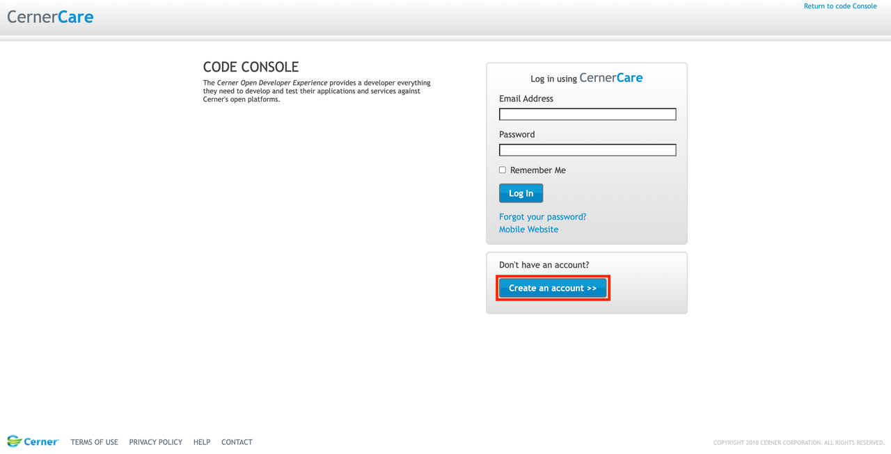

5. Complete the following steps on the Create Account page:
      - Enter the email with which you will log in.
      - Enter a strong password with 6 characters and at least one number or symbol.
      - Select security questions you will know the answers to.
      - Confirm that you are not a robot.
      - Read the Cerner Terms of Use and Cerner Privacy Policy and then select the consent check box.
      - Click Create Account.

   *Note: Save or remember your password as you will need it later.*

   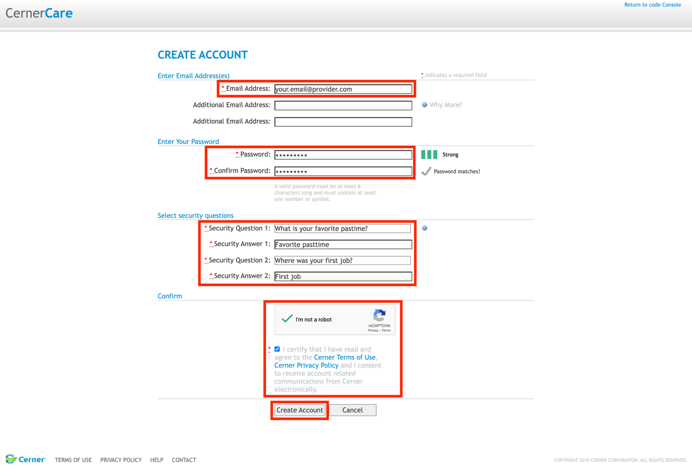

6. To finish registration, check your email and follow the instructions that are necessary to confirm your email and account.  

   *Note: You will need to wait a few minutes*

7. Congratulations! You now have a Code Console account ready to use.

## Task 2: Register a new application

*Note: If you just registered and followed the steps provided in the confirmation email, after you confirm your email you should be automatically logged in to Code Console. If that's the case you can skip to Step 3.*

1. Go to [https://code-console.cerner.com/](https://code-console.cerner.com/) and click Log In on the main page or in the header.

   

2. Log in to Code Console using your CernerCare account.

   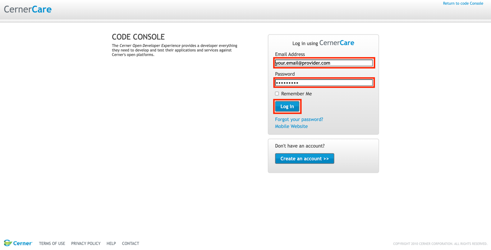

3. Confirm you are on the following page:

   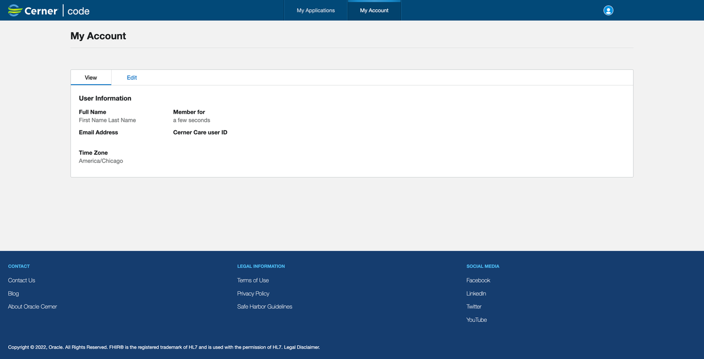

4. Click on My Applications tab.

   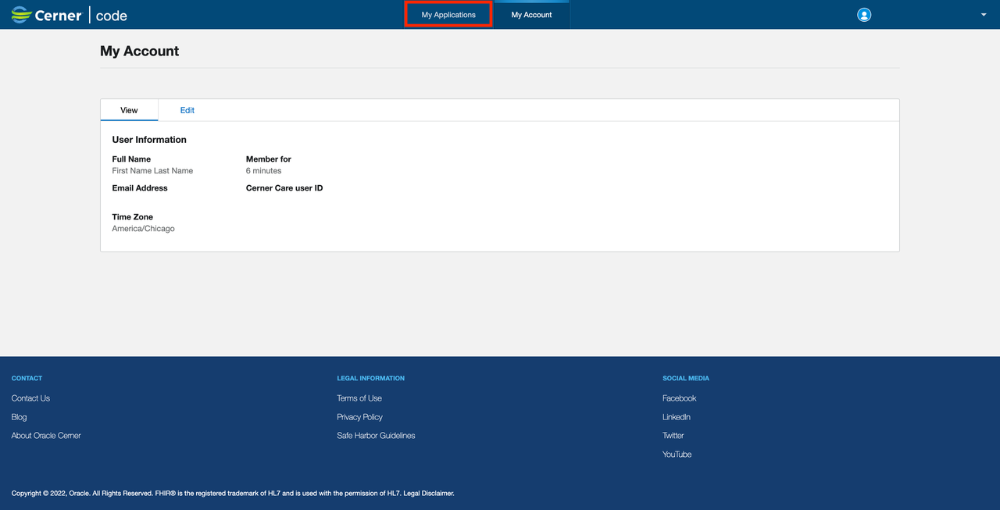

5. In the Authorized Representative of the Company dialog that’s displayed, enter the company name, read the terms of use and select the check box if you agree, and then click Save.

   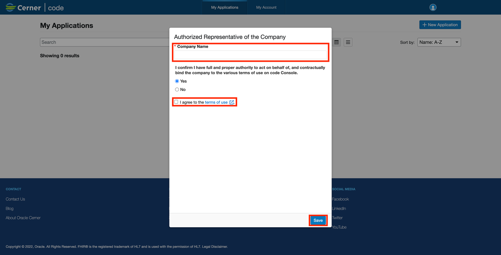

6. Click + New Application.

   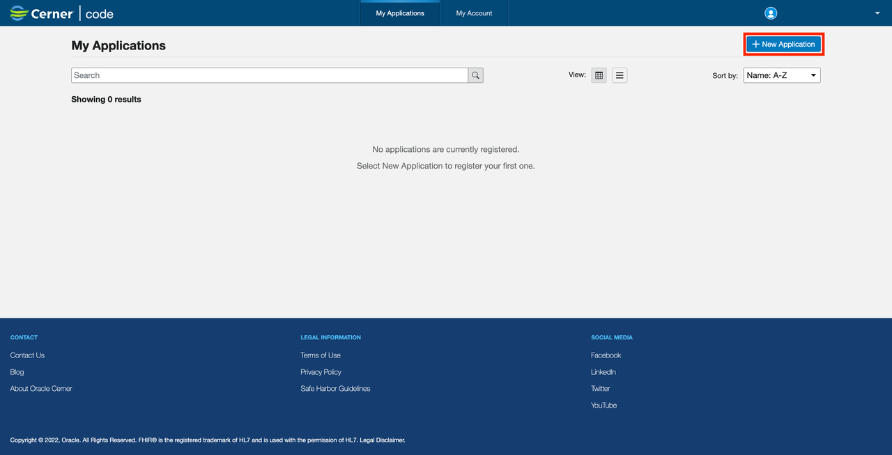

7. Complete the following fields on the Application Information page and then click **Next**:

      - **Application Name:** LiveLabs – ASCVD Risk Calculator
      - **Application Type:** Leave as Provider
      - **Type of Access:** Leave as Online
      - **Application Privacy:** Leave as Public
      - *Note: Here you will use the application alias and workspace name that you previously noted. If you named your application ASCVD Risk Calculator then your application alias will be ascvd-risk-calculator. Ensure that everything is lowercase.*
      - **Redirect URI:** If you use apex.oracle.com, update the following link with the required data: https://apex.oracle.com/pls/apex/r/your-workspace/your-app-alias/index-page-alias
      - **Application Alias:** ascvd-risk-calculator
      - **Index Page Alias:** index
      - **SMART® Launch URI:** If you use apex.oracle.com, update the following link with the required data: https://apex.oracle.com/pls/apex/r/your-workspace/your-app-alias/launch-page-alias
      - **Launch Page Alias:** launch
      - **Default FHIR® Version:** R4

   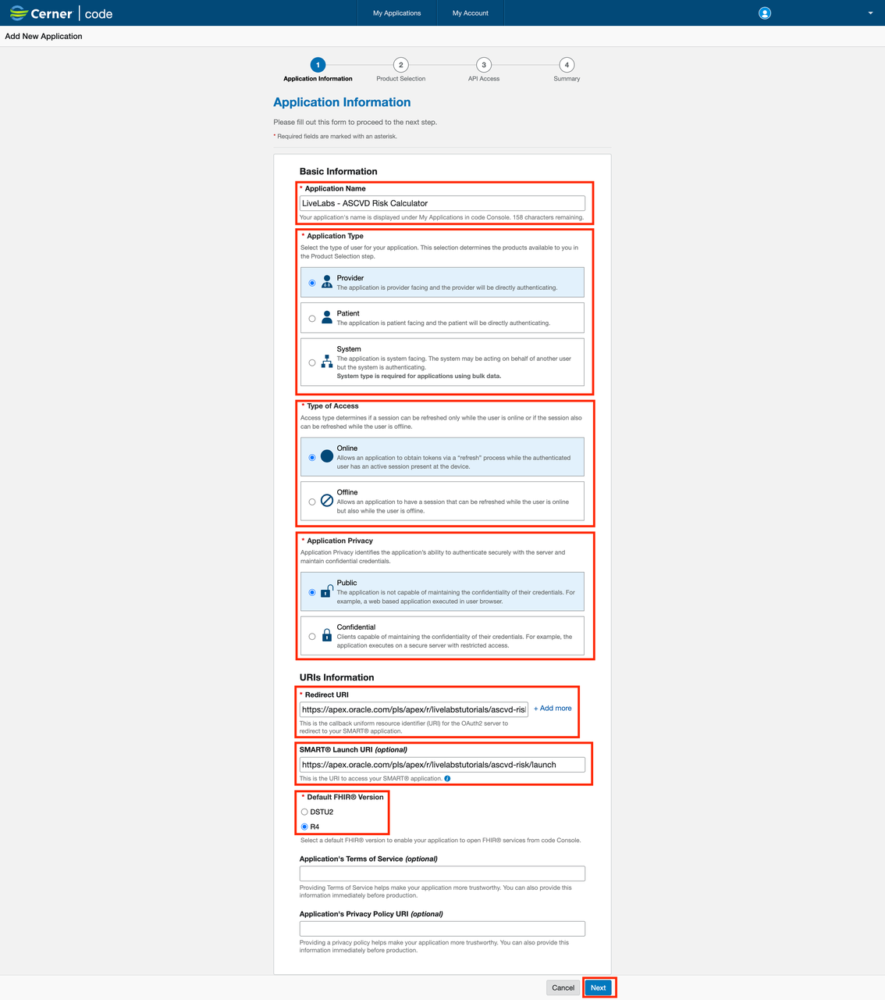

8. Complete the following fields on the Product Selection page and then click **Next**:

      - **Select a Product Family:** Millennium
      - **Select Products:** Ignite APIs for Millennium: FHIR R4, All

   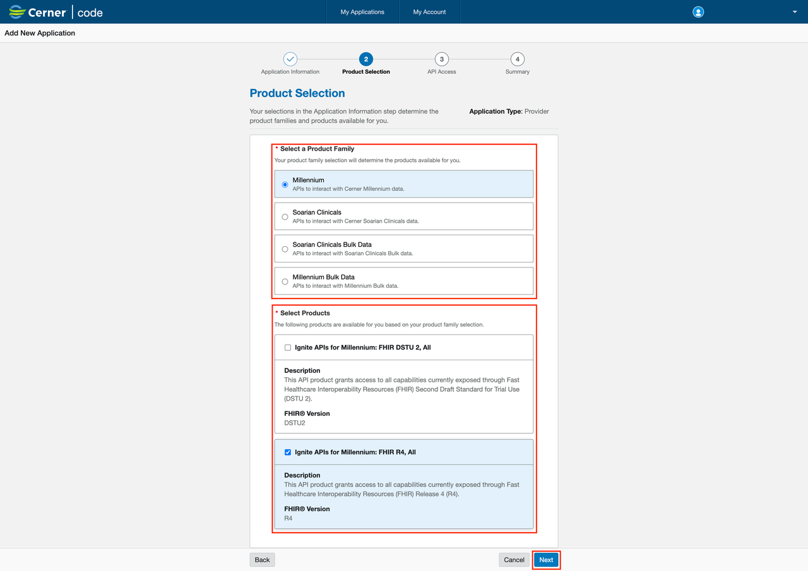

9. On the API Access page, review the following information in the Patient Product APIs section and then click Next:

      - For the Observation API, ensure that Access Level is Read.
      - For the Patient API, ensure that Access Level is Read.

   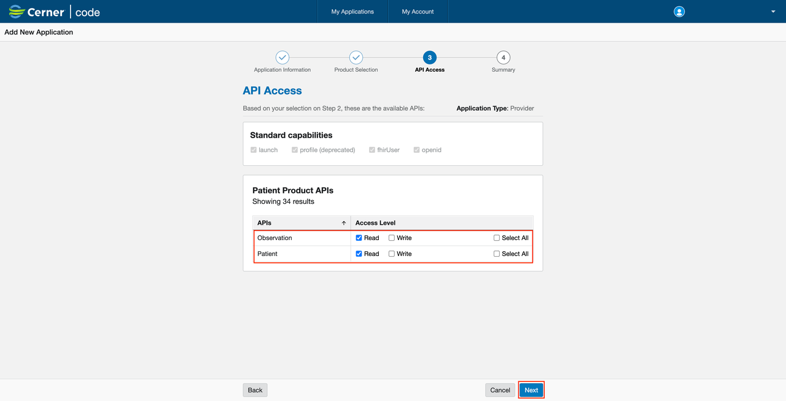

10. Confirm everything is looking as expected. Read the terms of use and select the check box if you agree and then click **Submit**.

   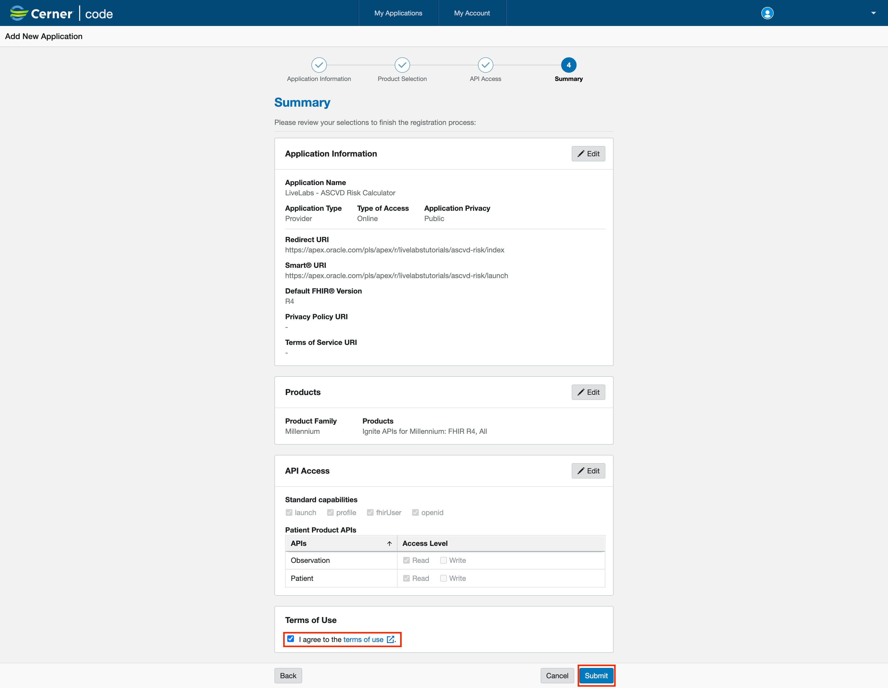

11. **Congratulations**! You now have your first Code Console application created. After its creation you should be able to see it on the **My Applications** tab.

   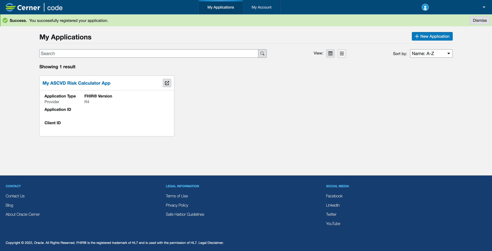

12. Click on the newly created application and look for Client Id, write down the UUID, you will use it later in the APEX Application to authenticate/authorize.

   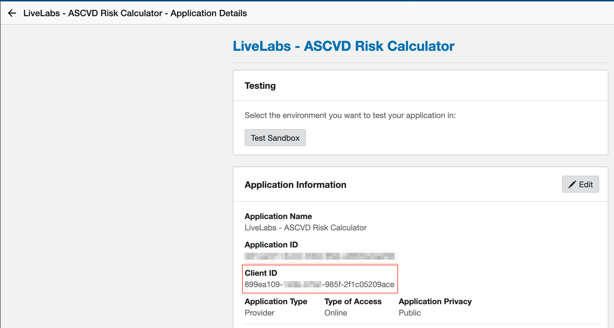

## Acknowledgements

* **Author** - Mircea Iordache, Software Engineer, OHAI - Platform Initiatives

* **Contributors**
      * Alexandru Basarab, Software Development Manager, OHAI - Platform Initiatives
      * Tudor Dragomir, Software Engineer, OHAI - Platform Initiatives
      * Ionut Balan, Software Engineer, OHAI - Platform Initiatives
      * Cornel Porosnicu, Software Engineer, OHAI - Platform Initiatives

* **Last Updated By/Date** - Alexandru Basarab, August 2023