# Create ASCVD Risk Calculator

## Introduction

This lab walks you through the steps to build a fully functional ASCVD (Atherosclerotic Cardiovascular Disease) Risk Calculator.

Estimated Lab Time: 80 minutes

### Objectives

In this lab, you will:

* Configure ASCVD Risk Calculator
* Import supporting objects
* Create application structure
* Define page objects
* Create validations
* Assign values
* Represent data
* Display database data in your application
* (Optional) Esthetics and finishing touches

### Prerequisites

This lab assumes you have:

* An Oracle Cloud account
* All previous labs successfully completed

## Task 1: Configure ASCVD Risk Calculator

1. If you have not already logged into your Oracle APEX workspace, sign in using the workspace name, email, and password you signed up with.

   

2. At the top left of your workspace, click **App Builder**.

   

3. Open **ASCVD Risk Calculator**

   

4. Open **Shared Components**

   

5. Under Files and Reports select **Static Application Files**

   

6. Click on **Create File**

   *Note: From here you will be able to import needed dependencies.*

   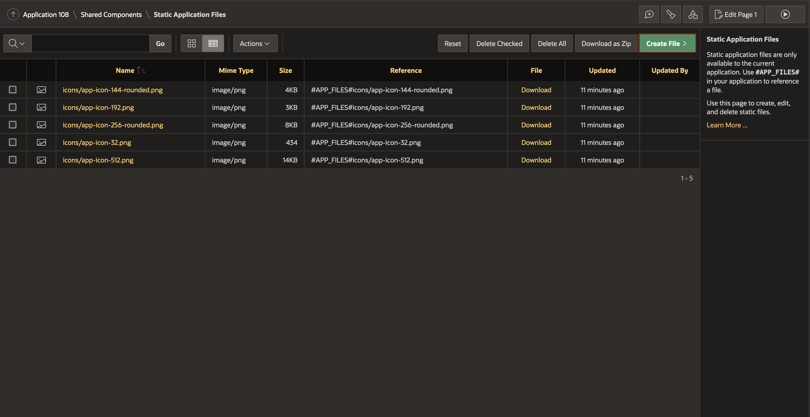

7. Download the following dependencies.

   <a href="../0-introduction/files/fhir-client.min.js" download>SMART on FHIR</a> official JavaScript library.

   <a href="../0-introduction/files/ascvd-risk.min.js" download>ASCVD Risk Calculator</a> JavaScript library.

8. Click on Drag and Drop and select step 7 downloaded dependencies.

   

9. Select the dependencies fhir-client.min.js, ascvd-risk.min.js and press **Open**, after selection you need to press **Create** to add them to your application.

   

10. Press on **Static Application Files** in order to see the files.

11. Files should be loaded and you can see the following screen.

   

12. To go back to application overview press on the application id in the top left corner, in the breadcrumb.

   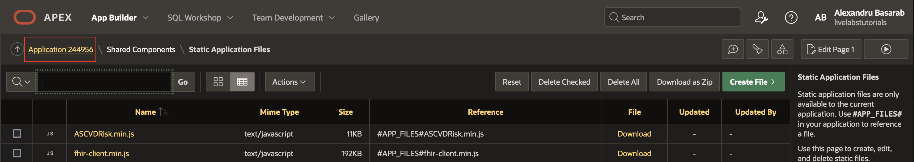

13. Click on **Global Page** to edit it.

   

14. Right click on **Body** and press **Create Page Item**

   

15. Create four similar items, ISS, CODE, LAUNCH and STATE.

      *Note: They need to have this exact names (ISS, CODE, LAUNCH, STATE), these four items will be used by SMART on FHIR JavaScript Library. Below is an example of how to create item ISS, leave the rest of the settings as they defaulted*

      **Identification > Name:** `ISS`

      **Identification > Type:** Hidden

      

      *Remember to **Save** the page regularly, to not lose any progress!*

16. Click on the application id in the top left corner and then look for  **Launch** page and open it, in page attributes edit then JavaScript section to add dependencies.

   *Note: Make sure to edit the code-console-client-id in the below Javascript snippet and replace it with Client Id given by Code Console.*

   **JavaScript > File URL's:** #APP_FILES#fhir-client.min.js

   **Javascript > Function and Global Variable Declaration:**

      ```js
      <copy>
      apex.widget.waitPopup();

      FHIR.oauth2.authorize({
         'clientId': 'code-console-client-id',
         'scope': 'patient/Patient.read patient/Observation.read launch online_access openid profile',
         'redirectUri': 'index'
      });
      </copy>
      ```

   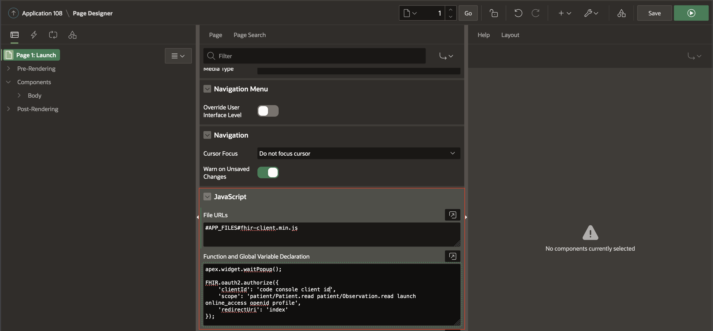

   *Remember to **Save** the page regularly, to not lose any progress!*

17. Click on the application id in the top left corner and then look for **Index** page and edit JavaScript section to add dependencies.

   **JavaScript > File URL's:**

      #APP_FILES#fhir-client.min.js

      #APP_FILES#ascvd-risk.min.js

   **Javascript > Function and Global Variable Declaration:**

      ```js
      <copy>
      apex.widget.waitPopup();

      ASCVDRisk.fetchPatientData().then(() => {
         ASCVDRisk.display('view');
      });
      </copy>
      ```

   

   *Remember to **Save** the page regularly, to not lose any progress!*

## Task 2: Import supporting objects

1. [Click here](files/supporting_objects.sql) to download the supporting objects SQL file.

2. In the main menu, select **SQL Workshop**, click **SQL Scripts**.

   

3. Click **Upload** choose `supporting_objects.sql` file press **Upload**.

    

4. Press run icon to run the uploaded script.

   

5. Confirm by clicking on **Run Now**.

   

6. Results should show 9 statements processed successfully.

   

## Task 3: Create application structure

1. Click on application id in the left corner and open **View** page.

  

2. Create patient information container by right clicking on **Body** and press **Create Region**.

  

  Copy the following code and add it to **Source > HTML Code** and name the region **ASCVD Risk Calculator**.

    ```html
    <copy>
    <<span class="u-color-9-text">Please be aware the application is an example and should not be used to calculate real risk factors!</span>
    <div id="patient-info"></div>
    </copy>
    ```

  

  Under **Appearance > Template** select **Hero** and **Appearance > Icon** add **fa-user** as icon.

  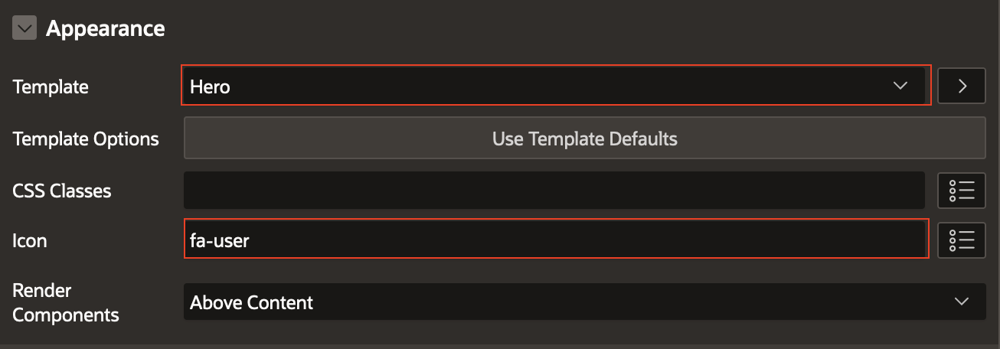

  Move the region to **Breadcrumb Bar**, in region attributes under Layout change region **Position**.

  

  *Remember to **Save** the page regularly, to not lose any progress!*

1. Create **Tabs** container by right clicking on **Body** and press **Create Region**.

  

  Under **Appearance** select **Tabs Container** template.
  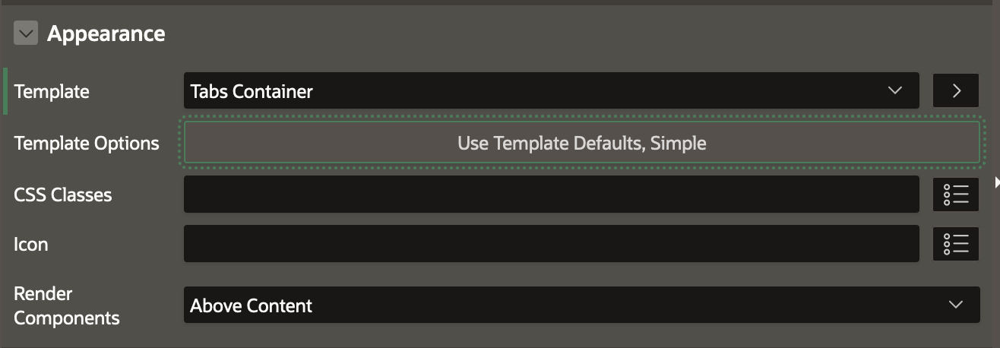

  Change **Template Options** of tab container by clicking on **Use Template Defaults**, when you've done the below changes press **Ok**.

  **Common > General:** check Remember Active Tab

  **Common > Layout:** Fill Tab Labels

  **Common > Tab Style:** Pill

  **Common > Tab Size:** Large

  

  Add a **Static Id** to the **Tabs Container** with the value **tabs**.
  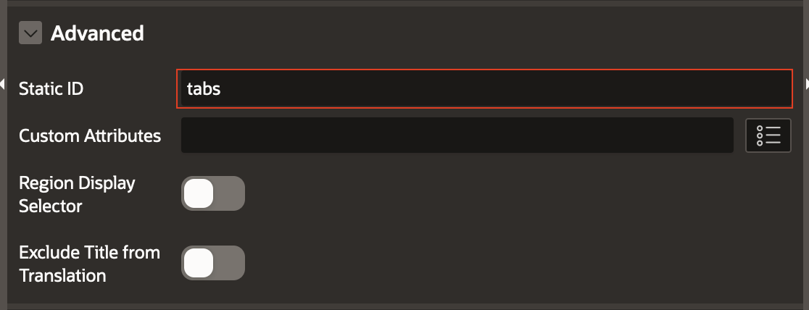

4. Create **Results** by right clicking on tabs container and press **Create Sub Region**.

  Name the region: **Results**

  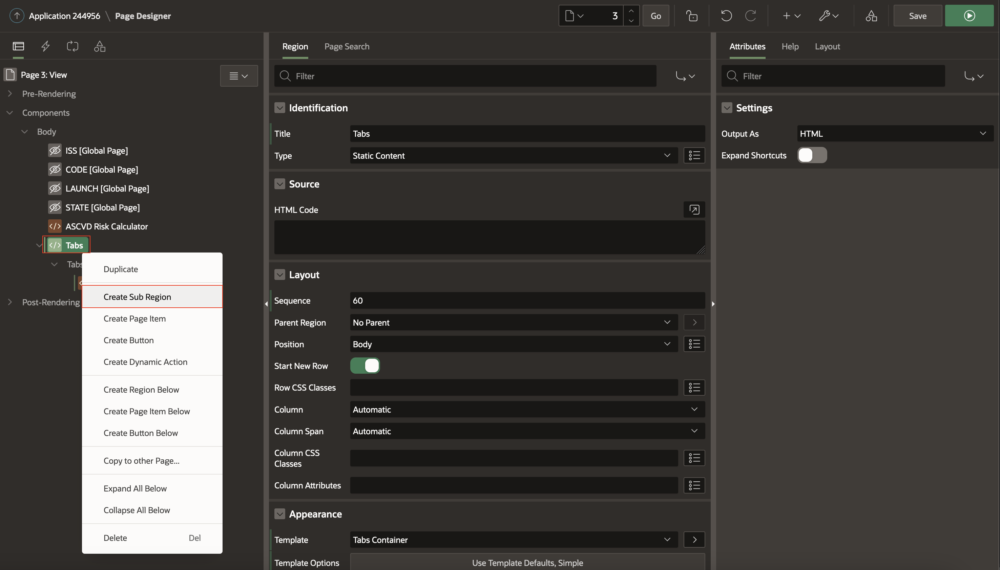

  In **Template Options** change **Common > Header** to Hidden but accessible.

  

5. Create **Risk Factors** by right clicking on tabs container and press **Create Sub Region**.

  **Identification > Title:** Risk Factors

  

  Change **Template Options** of risk factors container and press **Ok**.

  **Common > Header:** Hidden but accessible

  **Common > Style:** Remove UI Decoration

  

  Assign to **Risk Factors** region a static id, naming it **risk-factor**

  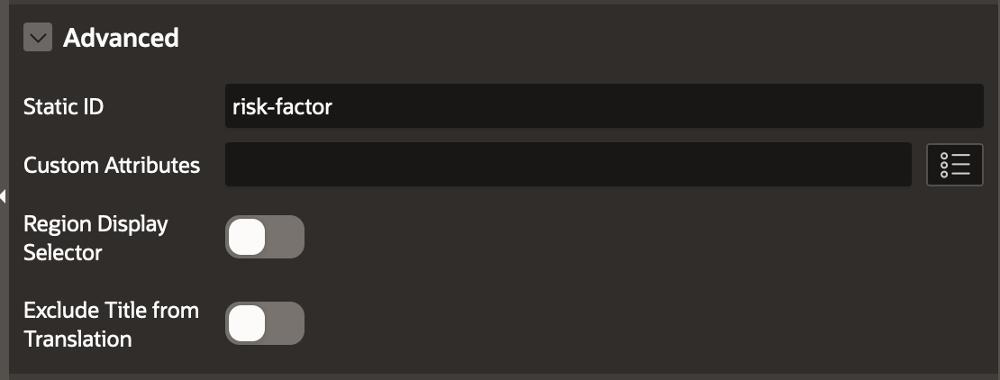

  Condition the region to show only when Request equals value **show**

  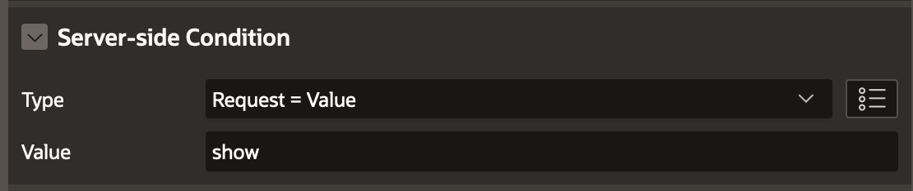

6. Create **Recommendations** by right clicking on tabs container and press **Create Sub Region**.

  

  Set the following attributes.

  **Identification > Title:** **Recommendations**

  **Identification > Title:** **Classic Report**

  **Source > Location:** Local Database

  **Source > Type:** SQL Query

  **Source > SQL Query:**

    ```sql
    <copy>
    select item_classes,
          selection,
          icon_class,
          icon_html,
          title,
          description,
          misc,
          actions
    from ASCVD_RECOMMENDATIONS
    </copy>
    ```

  

  Go to **Appearance > Template Options** and set **Header** to **Hidden but Accessible**.
  

  Go to **Advanced** and set **Static ID** to **recommendations** and **Server-side Conditions** to **Request = Value** and **Value** to **show**.
  

  Go to **Attributes** on the right tab and set the following attributes:

  **Appearance > Template:** Content Row

  **Pagination > Type:** No Pagination (Show All Rows)

  

  *Remember to **Save** the page regularly, to not lose any progress!*

## Task 4: Define page objects

1. Right click on **Results** container and press **Create Page Item**.  

  *Note: For each item you will create you need to repeat this step or follow step 3.*

  

2. Create radio group **Gender**.

  **Identification > Name:** `P3_GENDER`

  **Identification > Type:** Radio Group

  **Label:** Gender

  **Settings > Number of Columns:** 2

  **Appearance > Template:** Required - Above

  **Appearance > Template Option > Required Indicator:** Asterisk

  **Appearance > Template Option > Item Group Display:** Display as Pill Button

  

  Select static values under type of **List of Values** and add the following values

  

  **List of Values > Display Extra Values:** Unchecked

  **List of Values > Display Null Value:** Unchecked

3. (Optional) Duplicate a previously created item by right clicking on the item and click **Duplicate**.

  Note: For items that have the same type "Radio Group, Number Field" you can right click on the previews item created and click on **Duplicate**, this will allow you to create a new item with all the attributes of the duplicated item, only needing you to change the item name.

  

4. Create number field **Total Cholesterol (mg/dL)**.

  **Identification > Name:** `P3_TOTAL_CHOLESTEROL`

  **Identification > Type:** Number Field

  **Label:** Total Cholesterol (mg/dL)

  **Layout > Start New Row:** Unchecked

  **Appearance > Template:** Required - Above

  **Appearance > Template Option > Required Indicator:** Asterisk

  **Appearance > Value Placeholder:** 130 - 320

5. Create radio group **Diabetes**.

  **Identification > Name:** `P3_DIABETES`

  **Identification > Type:** Radio Group

  **Label:** Diabetes

  **Settings > Number of Columns:** 2

  **Layout > Start New Row:** Unchecked

  **Appearance > Template:** Required - Above

  **Appearance > Template Option > Required Indicator:** Asterisk

  **Appearance > Template Option > Item Group Display:** Display as Pill Button

  Select static values under type of **List of Values** and add the following values

  

  **List of Values > Display Extra Values:** Unchecked

  **List of Values > Display Null Value:** Unchecked

6. Create number field **Age**.

  **Identification > Name:** `P3_AGE`

  **Identification > Type:** Number Field

  **Label:** Age

  **Appearance > Template:** Required - Above

  **Appearance > Template Option > Required Indicator:** Asterisk

7. Create number field **HDL - Cholesterol (mg/dL)**.

  **Identification > Name:** `P3_HDL`

  **Identification > Type:** Number Field

  **Label:** HDL - Cholesterol (mg/dL)

  **Layout > Start New Row:** Unchecked

  **Appearance > Template:** Required - Above

  **Appearance > Template Option > Required Indicator:** Asterisk

  **Appearance > Value Placeholder:** 20 - 100

8. Create radio group **Current Smoking**.

  **Identification > Name:** `P3_SMOKING`

  **Identification > Type:** Radio Group

  **Label:** Current Smoking

  **Settings > Number of Columns:** 2

  **Layout > Start New Row:** Unchecked

  **Appearance > Template:** Required - Above

  **Appearance > Template Option > Required Indicator:** Asterisk

  **Appearance > Template Option > Item Group Display:** Display as Pill Button

  Select static values under type of **List of Values** and add the following values

  

  **List of Values > Display Extra Values:** Unchecked

  **List of Values > Display Null Value:** Unchecked

9. Create radio group **Race**.

  **Identification > Name:** `P3_RACE`

  **Identification > Type:** Radio Group

  **Label:** Race

  **Settings > Number of Columns:** 1

  **Layout > Start New Row:** Checked

  **Appearance > Template:** Required - Above

  **Appearance > Template Option > Required Indicator:** Asterisk

  Select static values under type of **List of Values** and add the following values

  

  **List of Values > Display Extra Values:** Unchecked

  **List of Values > Display Null Value:** Unchecked

10. Create number field **Systolic Blood Pressure**.

  **Identification > Name:** `P3_SYSTOLIC_BP`

  **Identification > Type:** Number Field

  **Label:** Systolic Blood Pressure

  **Layout > Start New Row:** Unchecked

  **Appearance > Template:** Required - Above

  **Appearance > Template Option > Required Indicator:** Asterisk

  **Appearance > Value Placeholder:** 90 - 200

11. Create radio group **Treatment for Hypertension**.

  **Identification > Name:** `P3_HYPERTENSION`

  **Identification > Type:** Radio Group

  **Label:** Treatment for Hypertension

  **Settings > Number of Columns:** 2

  **Layout > Start New Row:** Unchecked

  **Appearance > Template:** Required - Above

  **Appearance > Template Option > Required Indicator:** Asterisk

  **Appearance > Template Option > Item Group Display:** Display as Pill Button

  Select static values under type of **List of Values** and add the following values

  

  **List of Values > Display Extra Values:** Unchecked

  **List of Values > Display Null Value:** Unchecked

  *Remember to **Save** the page regularly, to not lose any progress!*

12. Right click on **Region Body** under Results container and press **Create Button**.

  

13. Change button attributes as follows.

  **Identification > Button Name:** CALCULATE_RISK

  **Label:** See Risk Score

  **Appearance > Template Options > Size:** Large

  **Appearance > Template Options > Type:** Primary

14. Create a new branch by selecting processing tab (third tab just below of your application id) and right click on **Processing** and click **Create Branch**.

  

15. Change branch attributes.

  **Identification > Name:** Go To Page view

  **Behavior > Type:** Page or URL (Redirect)

  **Behavior > Target:** view

  

  **Server-side Condition > When Button Pressed:** CALCULATE_RISK

  *Remember to **Save** the page regularly, to not lose any progress!*

## Task 5: Create validations

1. Go to processing and right click on **Validating** and select **Create Validation**.

  

2. Create **Age** validation.

  **Identification > Name:** `P3_AGE` range plsql

  **Validation > Type:** Function Body (returning Boolean)

  **PL/SQL Function Body:**

    ```PlSql
    <copy>
    begin
      if :P3_AGE between 20 and 79 then
        return true;
      end if;
      return false;
    end;
    </copy>
    ```

  **Error > Error Message:** #LABEL# must be within 20-79

  **Error > Associated Item:** `P3_AGE`

  **Server-side Condition > When Button Pressed:** CALCULATE_RISK

  

3. Create the rest of the validations by right click on `P3_AGE` range plsql and select duplicate.

  Change Name, PL/SQL Code, Error Message and Associated Item

  

4. Total Cholesterol (mg/dL) validation.

  **Identification > Name:** `P3_TOTAL_CHOLESTEROL` range plsql

  **PL/SQL Function Body:**

    ```PlSql
    <copy>
    begin
      if :P3_TOTAL_CHOLESTEROL between 130 and 320 then
        return true;
      end if;
      return false;
    end;
    </copy>
    ```

  **Error > Error Message:** Total Cholesterol must be within 130-320 mg/dL

  **Error > Associated Item:** `P3_TOTAL_CHOLESTEROL`

5. HDL - Cholesterol (mg/dL) validation.

    **Identification > Name:** `P3_HDL` range plsql

    **PL/SQL Function Body:**

    ```PlSql
    <copy>
    begin
      if :P3_HDL between 20 and 100 then
        return true;
      end if;
      return false;
    end;
    </copy>
    ```

    **Error > Error Message:** HDL must be within 20-100 mg/dL

    **Error > Associated Item:** `P3_HDL`

6. Systolic Blood Pressure validation.

    **Identification > Name:** `P3_SYSTOLIC_BP` range plsql

    **PL/SQL Function Body:**

    ```PlSql
    <copy>
    begin
      if :P3_SYSTOLIC_BP between 90 and 200 then
        return true;
      end if;
      return false;
    end;
    </copy>
    ```

    **Error > Error Message:** SBP must be within 90-200 mmHg

    **Error > Associated Item:** `P3_SYSTOLIC_BP`

7. Create Item is not null validation for the following items.

  `P3_DIABETES, P3_SMOKING, P3_HYPERTENSION, P3_RACE, P3_GENDER`

  

  Note: change each time **Validation > Item** and **Error > Associated Item:** to the corresponding item.  
  *Remember to **Save** the page regularly, to not lose any progress!*

## Task 6: Assign values

1. Under Dynamic Actions right click on Page Load and click **Create Dynamic Action**.

  Name the Dynamic Action: **Show Patient Info**

  

2. Change the Show action under True into **Execute JavaScript Code**.

    

  **Identification > Name:** Set Patient Info

  **Identification > Action:** Execute JavaScript Code

  **Settings > Code**
    ```js
    <copy>
    let patientInfo = JSON.parse(sessionStorage.getItem("ASCVDRisk.patientInfo"));

    if (patientInfo !== null) {
      $("#patient-info").append(patientInfo.firstName + ' ' + patientInfo.lastName + ' </br> ' +
        patientInfo.age + ' yrs ' + patientInfo.gender + ' DOB: ' + patientInfo.birthDateDisplay);
    }
    </copy>
    ```

    **Execution > Fire on Initialization:** Checked

3. Click on True and add a new Action.

   

  **Identification > Name:** Retrieve Patient Data

  **Identification > Action:** Execute JavaScript Code

  **Settings > Code:**
    ```js
    <copy>
      (function() {
          let patientInfo = JSON.parse(sessionStorage.getItem("ASCVDRisk.patientInfo"));
          if (patientInfo !== null) {
              apex.item("P3_AGE").setValue(patientInfo.age);
              apex.item("P3_GENDER").setValue(patientInfo.gender);
              apex.item("P3_TOTAL_CHOLESTEROL").setValue(patientInfo.totalCholesterol);
              apex.item("P3_HDL").setValue(patientInfo.hdl);
              apex.item("P3_SYSTOLIC_BP").setValue(patientInfo.systolicBloodPressure);
              apex.item("P3_RACE").setValue(patientInfo.relatedFactors.race);
              apex.item("P3_DIABETES").setValue(patientInfo.relatedFactors.diabetic);
              apex.item("P3_SMOKING").setValue(patientInfo.relatedFactors.smoker);
              apex.item("P3_HYPERTENSION").setValue(patientInfo.relatedFactors.hypertensive);
          }
      })()
    </copy>
    ```

  **Affected Elements > Selection Type:** Item(s)

  **Affected Elements > Item(s):**
  `P3_AGE,P3_GENDER,P3_TOTAL_CHOLESTEROL,P3_HDL,P3_SYSTOLIC_BP,P3_DIABETES,P3_SMOKING,P3_HYPERTENSION`

  Note: If you followed the workshop exactly and named all the objects as above then you can copy/paste them, if not change with the according object names.

  *Remember to **Save** the page regularly, to not lose any progress!*

## Task 7: Represent data

1. Right click on **Region Body** under Risk Factors container and press **Create Region**.
   

  **Identification > Name:** Chance of heart attack or stroke

  **Identification > Type:** Chart

2. Create **Current Risk** series.

   Click under **Series** on New and change the following attributes

   **Identification > Name:** Current Risk

   **Source > Type:** SQL Query

   **Source > SQL Query:**

    ```sql
    <copy>
      select ASCVD_RISK_CALCULATOR.computeTenYearScore(:P3_AGE,
                                                      :P3_TOTAL_CHOLESTEROL,
                                                      :P3_HDL,
                                                      :P3_SYSTOLIC_BP,
                                                      :P3_HYPERTENSION,
                                                      :P3_SMOKING,
                                                      :P3_DIABETES,
                                                      :P3_RACE,
                                                      :P3_GENDER) / 100 as chart_value,
            '10 Year Risk' as chart_label
      from dual where :P3_AGE > 39
      union
      select ASCVD_RISK_CALCULATOR.computeLifetimeRisk(:P3_AGE,
                                                      :P3_TOTAL_CHOLESTEROL,
                                                      :P3_HDL,
                                                      :P3_SYSTOLIC_BP,
                                                      :P3_HYPERTENSION,
                                                      :P3_SMOKING,
                                                      :P3_DIABETES,
                                                      :P3_RACE,
                                                      :P3_GENDER) / 100 as chart_value,
            'Lifetime Risk' as chart_label
      from dual where :P3_AGE < 60
    </copy>
    ```

  **Column Mapping > Label:** `CHART_LABEL`

  **Column Mapping > Value:** `CHART_VALUE`

  **Label > Show:** Checked

  **Label > Position:** Outside Slice

3. Create **Lowest Possible Risk** series.

   Right Click on **Series** and create a new series

   

   **Identification > Name:** Lowest Possible Risk

   **Source > Type:** SQL Query

   **Source > SQL Query:**

    ```sql
    <copy>
    select ASCVD_RISK_CALCULATOR.computeLowestTenYear(:P3_AGE, :P3_RACE, :P3_GENDER) / 100 as chart_value,
          '10 Year Risk' as chart_label
    from dual where :P3_AGE > 39
    union
    select ASCVD_RISK_CALCULATOR.computeLowestLifetime(:P3_AGE, :P3_RACE, :P3_GENDER) / 100 as chart_value,
          'Lifetime Risk' as chart_label
    from dual where :P3_AGE < 60
    </copy>
    ```

  **Column Mapping > Label:** `CHART_LABEL`

  **Column Mapping > Value:** `CHART_VALUE`

  **Label > Show:** Checked

  **Label > Position:** Outside Slice

4. Under **Axes** select **y** and change the title and value representation.

   **Identification > Title:** Percent (%)

   **Value > Minimum:** 0

   **Value > Maximum:** 1

   **Value > Format:** Percent

   **Value > Decimal Places:** 2

   **Value > Format Scaling:** Automatic

   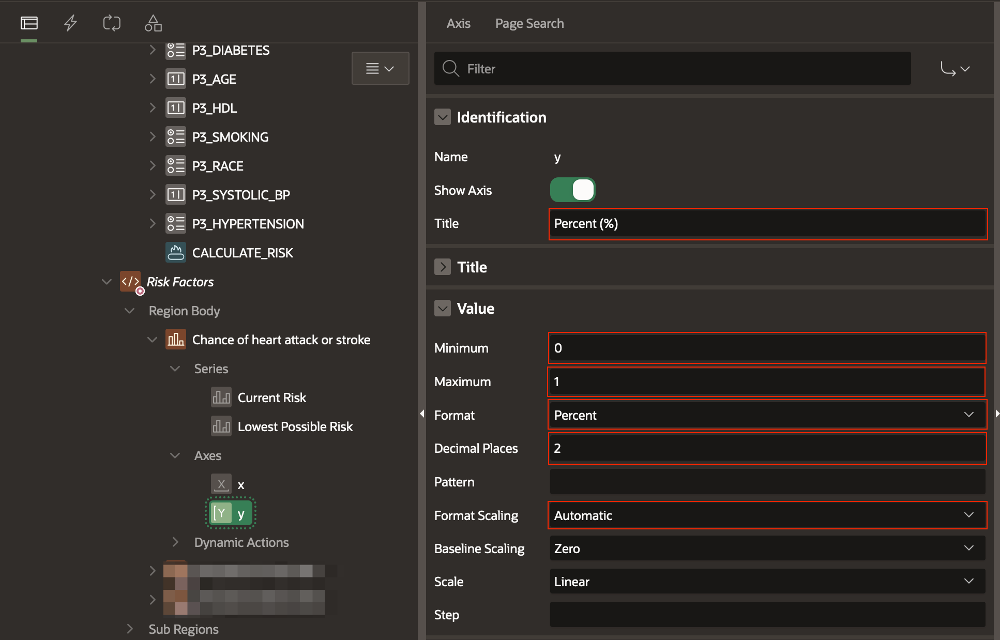

5. Enable charts **Legend** by clicking on the chart region "Chance of heart attack or stroke" and in the Attributes under Legend check **Show**.

  

  *Remember to **Save** the page regularly, to not lose any progress!*

## Task 8 (Optional): Esthetics and finishing touches

1. Select rendering tab and open page attributes.

  

2. Change the following attributes.

  **Appearance > Page Template:** Minimal (No Navigation)

  **CSS > Inline:**

    ```css
    <copy>
    .apex-button-group label, .t-Form-fieldContainer--radioButtonGroup .apex-item-group--rc label {
    padding-block-end: calc(var(--a-field-input-padding-y, .25rem) - var(--a-field-input-border-width, 1px));
    padding-block-start: var(--ut-field-fl-label-offset,calc(var(--a-field-input-padding-y, .25rem) - var(--a-field-input-border-width, 1px)));
    padding-inline-end: calc(var(--a-field-input-padding-x, .25rem) - var(--a-field-input-border-width, 1px));
    padding-inline-start: var(--ut-field-input-padding-x-offset,calc(var(--a-field-input-padding-x, .25rem) - var(--a-field-input-border-width, 1px)));
    }
    </copy>
    ```

3. Click on dynamic action tab and right click on **Events** and create a **Dynamic Action**.

  **Identification > Name:** Show Risk Factors

  **When > Event:** After Refresh

  **When > Selection Type:** Region

  **When > Region:** Chance of heart attack or stroke

  **Server-side Condition > Type:** Request = Value

  **Server-side Condition > Value:** show

  

  *Remember to **Save** the page regularly, to not lose any progress!*

4. Right click on True under Show Risk Factors Dynamic Action to create a new **True Action**.

    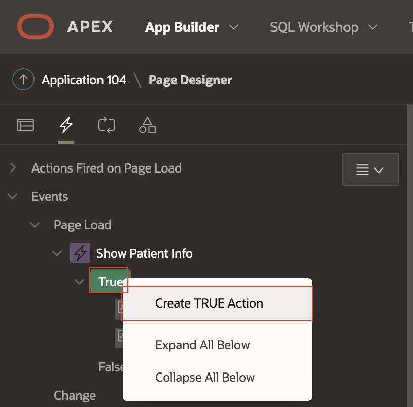

5. Change the true action as follows.

  **Identification > Action:** Execute JavaScript Code

  **Settings > Code:**

    ```js
    <copy>
      apex.region("tabs").widget().aTabs("getTabs")["#SR_risk-factor"].makeActive();
    </copy>
    ```

  **Affected Elements > Section Type:** Region

  **Affected Elements > Region:** ..Results

   

## Acknowledgements

* **Author** - Alexandru Basarab, Software Development Manager, OHAI - Platform Initiatives

* **Contributors**
    * Mircea Iordache, Software Engineer, OHAI - Platform Initiatives
    * Tudor Dragomir, Software Engineer, OHAI - Platform Initiatives
    * Ionut Balan, Software Engineer, OHAI - Platform Initiatives
    * Cornel Porosnicu, Software Engineer, OHAI - Platform Initiatives

* **Last Updated By/Date** - Basarab Alexandru, August 2023
