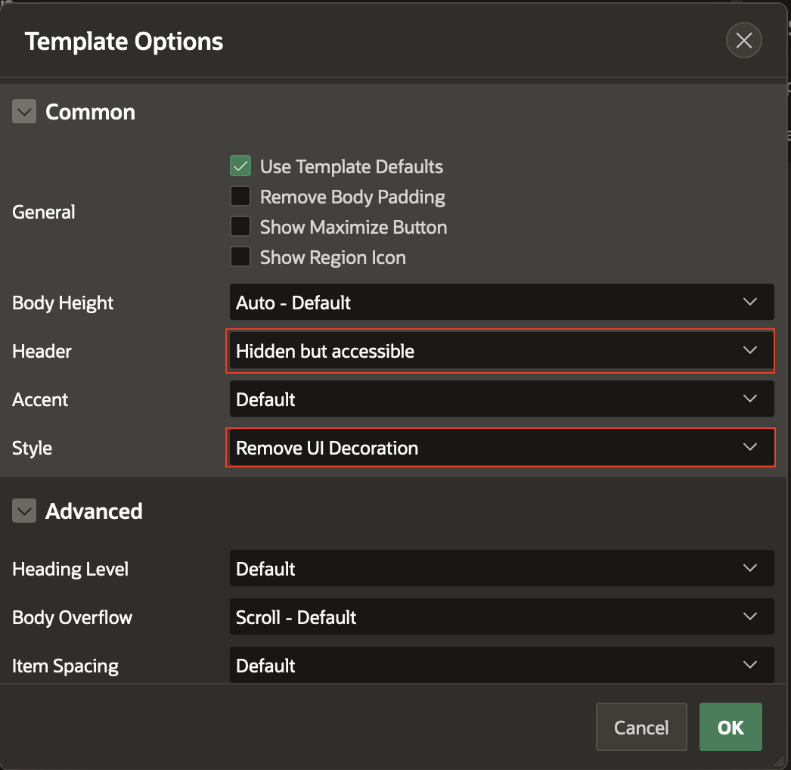
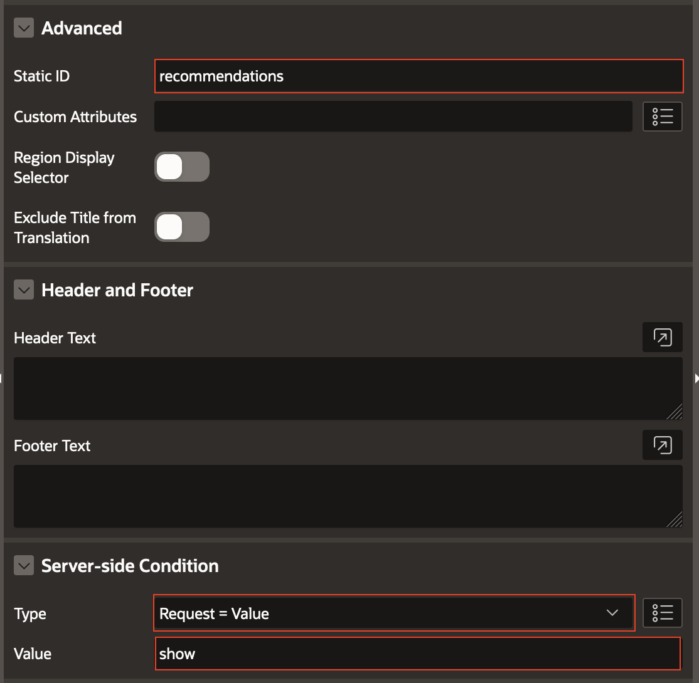
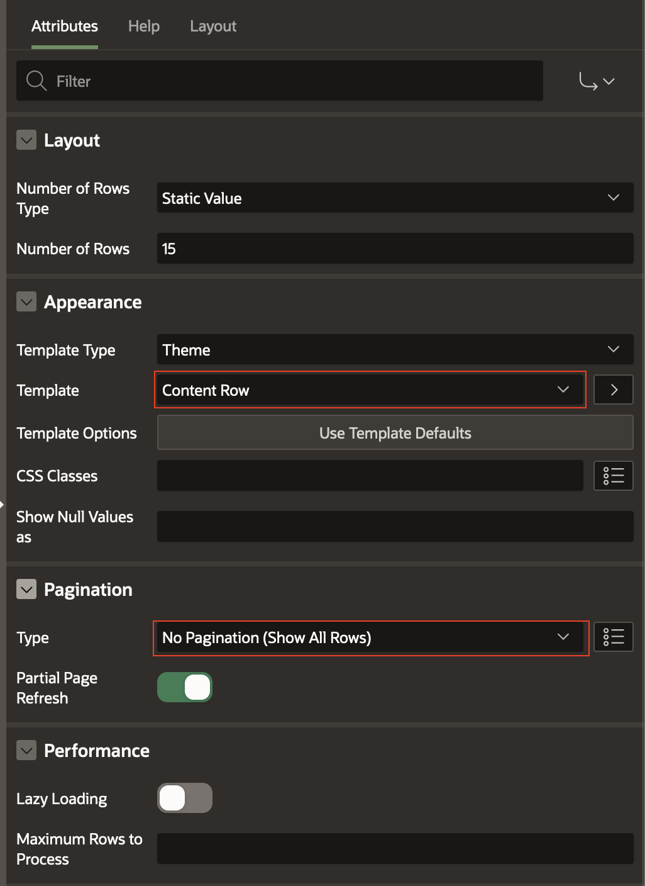

# Creating an ASCVD Risk Calculator

## Introduction

This lab walks you through the steps to build a fully functional ASCVD (Atherosclerotic Cardiovascular Disease) Risk Calculator.

Estimated Lab Time: -- minutes

### Objectives

In this lab, you will:

* Creating page structure
* Creating page items
* Create item validations
* Assigning values to items
* Creation of charts to represent data
* Display database data in your application
* Esthetics and finishing touches

### Prerequisites

This lab assumes you have:

* An Oracle Cloud account
* All previous labs successfully completed

## Task 1: Creation of Page structures

1. Open View page

    

2. Create patient information container

    Right click on Body and press Create Region

    

3. Edit region attributes

    Name and add html

    

    Change appearance

    

4. Create Tabs container

    

    Change template options of tab container

    

5. Create Results

    Right click on tabs container and press Create Sub Region
    Name the region: **Results**

    

    Change template options of results container

    

6. Create Risk Factors

    Right click on tabs container and press Create Sub Region
    Name the region: **Risk Factors**

    

    Change template options of risk factors container

    

    Assign to Risk Factors region a static id, naming it **risk-factor**

    

    Condition the region to show only when Request equals value show

    

7. Create Recommendations

   Right click on tabs container and press Create Sub Region
    Name the region: **Recommendations**

    

   Select Classic Report
    Name the region: **Recommendations**

    
    ```sql
    select item_classes,
           selection,
           icon_class,
           icon_html,
           title,
           description,
           misc,
           actions
    from ASCVD_RECOMMENDATIONS
    ```
    Change Template Options of Header to Hidden but accessible
    

    Add a static id and server-side conditioning
    

    Change region attributes to show all table rows.
    

## Task 2: Defining Page items

1. Step 1 - tables sample

## Task 3: Create item validations

## Task 4: Assigning values to items

## Task 5: Create charts to represent data

## Task 6: Use the Autonomous Database to store data

## Task 7: Esthetics and finishing touches

## Learn More

* [URL text 1](http://docs.oracle.com)
* [URL text 2](http://docs.oracle.com)

## Acknowledgements

* **Author** - Alexandru Basarab, Senior Software Engineer, Open Platform

* **Contributors** - Mircea Iordache, Software Engineer, Open Platform

* **Last Updated By/Date** - <Name, Month Year>
