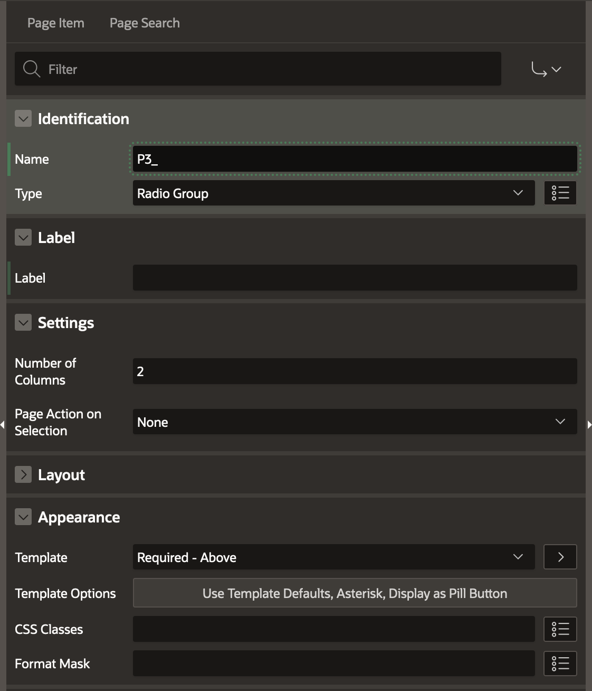
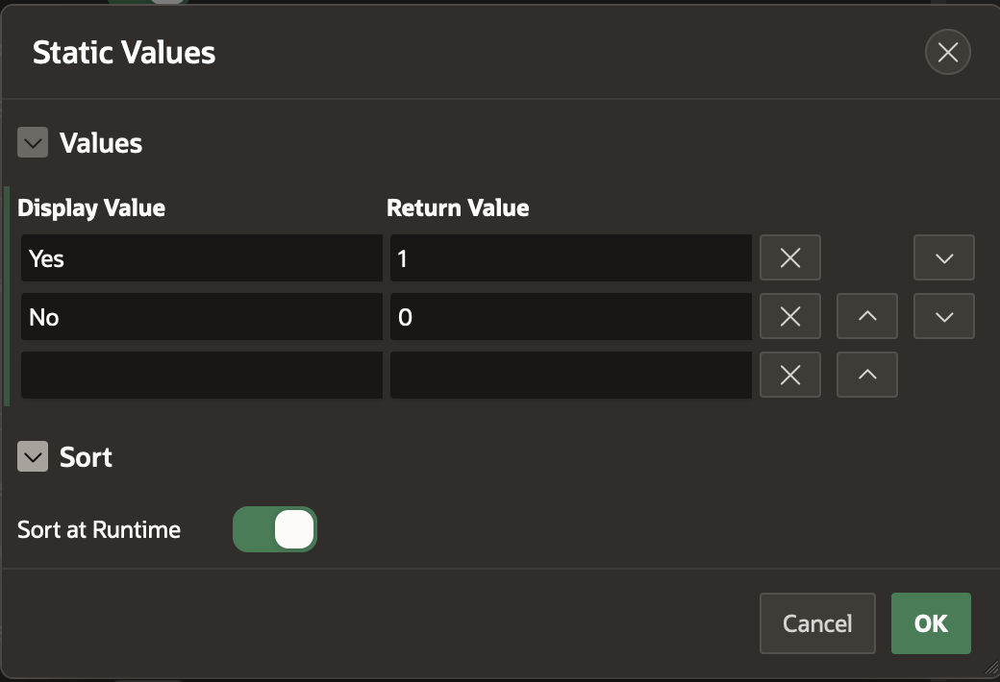
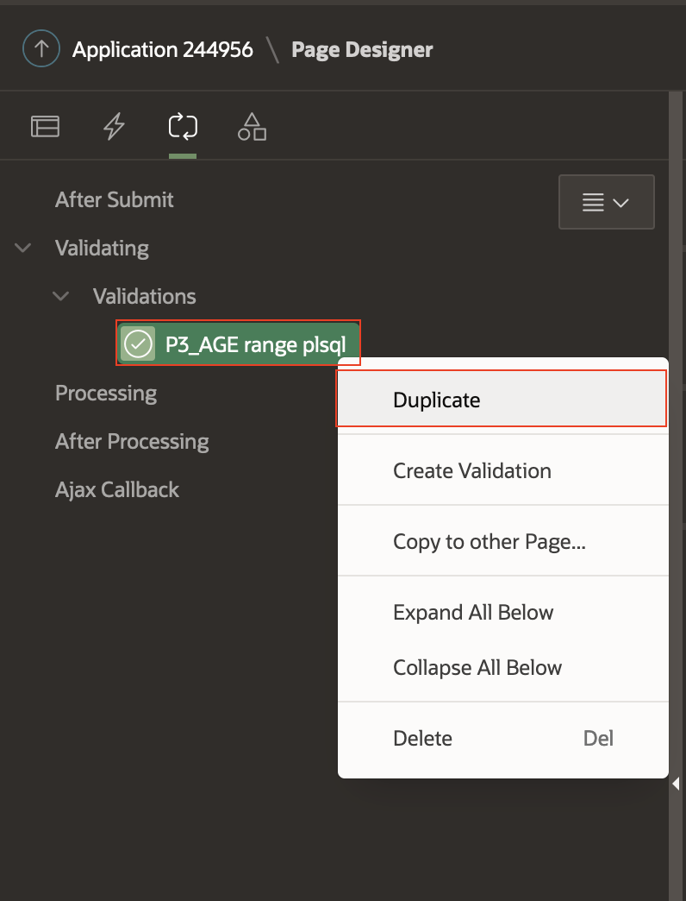

# Creating an ASCVD Risk Calculator

## Introduction

This lab walks you through the steps to build a fully functional ASCVD (Atherosclerotic Cardiovascular Disease) Risk Calculator.

Estimated Lab Time: -- minutes

### Objectives

In this lab, you will:

* Creating page structure
* Creating page items
* Create item validations
* Assigning values to items
* Creation of charts to represent data
* Display database data in your application
* Esthetics and finishing touches

### Prerequisites

This lab assumes you have:

* An Oracle Cloud account
* All previous labs successfully completed

## Task 1: Creation of Page structures

1. Open **View** page

    

2. Create patient information container

    Right click on **Body** and press **Create Region**

    

    Name and add html

    ```html
    <copy>
    <div id="patient-info"></div>
    </copy>
    ```

    

    Change appearance to **Hero** and add **fa-user** as icon

    

3. Create **Tabs** container

    Right click on **Body** and press **Create Region**

    

    Select **Tabs Container** template
    

    Change template options of tab container

    

4. Create **Results**

    Right click on tabs container and press **Create Sub Region**
    Name the region: **Results**

    

    Change template options of results container

    

5. Create **Risk Factors**

    Right click on tabs container and press **Create Sub Region**
    Name the region: **Risk Factors**

    

    Change template options of risk factors container

    

    Assign to **Risk Factors** region a static id, naming it **risk-factor**

    

    Condition the region to show only when Request equals value **show**

    

6. Create **Recommendations**

   Right click on tabs container and press **Create Sub Region**

    

   Select Classic Report and name the region: **Recommendations**

    

    ```sql
    select item_classes,
           selection,
           icon_class,
           icon_html,
           title,
           description,
           misc,
           actions
    from ASCVD_RECOMMENDATIONS
    ```

    Change template options of header to **Hidden but accessible**
    

    Add a static id and server-side conditioning
    

    Change region attributes to show all table rows.
    

## Task 2: Defining Page items

1. Right click on **Results** container and press **Create Page Item**

   

2. Create radio group **Gender**

    **Identification > Name:** ```P3_GENDER```

    **Identification > Type:** Radio Group

    **Label:** Gender

    **Settings > Number of Columns:** 2

    **Appearance > Template:** Required - Above

    **Appearance > Template Option > Required Indicator:** Asterisk

    **Appearance > Template Option > Item Group Display:** Display as Pill Button

    

    Select static values under type of **List of Values** and add the following values

    

    **List of Values > Display Extra Values:** Unchecked

    **List of Values > Display Null Value:** Unchecked

3. Create number field **Total Cholesterol (mg/dL)**

    **Identification > Name:** ```P3_TOTAL_CHOLESTEROL```

    **Identification > Type:** Number Field

    **Label:** Total Cholesterol (mg/dL)

    **Layout > Start New Row:** Unchecked

    **Appearance > Template:** Required - Above

    **Appearance > Template Option > Required Indicator:** Asterisk

    **Appearance > Value Placeholder:** 130 - 320

4. Create radio group **Diabetes**

    **Identification > Name:** ```P3_DIABETES```

    **Identification > Type:** Radio Group

    **Label:** Diabetes

    **Settings > Number of Columns:** 2

    **Layout > Start New Row:** Unchecked

    **Appearance > Template:** Required - Above

    **Appearance > Template Option > Required Indicator:** Asterisk

    **Appearance > Template Option > Item Group Display:** Display as Pill Button

    Select static values under type of **List of Values** and add the following values

    

    **List of Values > Display Extra Values:** Unchecked

    **List of Values > Display Null Value:** Unchecked

5. Create number field **Age**

    **Identification > Name:** ```P3_AGE```

    **Identification > Type:** Number Field

    **Label:** Age

    **Appearance > Template:** Required - Above

    **Appearance > Template Option > Required Indicator:** Asterisk

6. Create number field **HDL - Cholesterol (mg/dL)**

    **Identification > Name:** ```P3_HDL```

    **Identification > Type:** Number Field

    **Label:** HDL - Cholesterol (mg/dL)

    **Layout > Start New Row:** Unchecked

    **Appearance > Template:** Required - Above

    **Appearance > Template Option > Required Indicator:** Asterisk

    **Appearance > Value Placeholder:** 20 - 100

7. Create radio group **Current Smoking**

    **Identification > Name:** ```P3_SMOKING```

    **Identification > Type:** Radio Group

    **Label:** Current Smoking

    **Settings > Number of Columns:** 2

    **Layout > Start New Row:** Unchecked

    **Appearance > Template:** Required - Above

    **Appearance > Template Option > Required Indicator:** Asterisk

    **Appearance > Template Option > Item Group Display:** Display as Pill Button

    Select static values under type of **List of Values** and add the following values

    

    **List of Values > Display Extra Values:** Unchecked

    **List of Values > Display Null Value:** Unchecked

8. Create radio group **Race**

    **Identification > Name:** ```P3_RACE```

    **Identification > Type:** Radio Group

    **Label:** Race

    **Settings > Number of Columns:** 2

    **Layout > Start New Row:** Checked

    **Appearance > Template:** Required - Above

    **Appearance > Template Option > Required Indicator:** Asterisk

    **Appearance > Template Option > Item Group Display:** Display as Pill Button

    Select static values under type of **List of Values** and add the following values

    

    **List of Values > Display Extra Values:** Unchecked

    **List of Values > Display Null Value:** Unchecked

9. Create number field **Systolic Blood Pressure**

    **Identification > Name:** ```P3_SYSTOLIC_BP```

    **Identification > Type:** Number Field

    **Label:** Systolic Blood Pressure

    **Layout > Start New Row:** Unchecked

    **Appearance > Template:** Required - Above

    **Appearance > Template Option > Required Indicator:** Asterisk

    **Appearance > Value Placeholder:** 90 - 200

10. Create radio group **Treatment for Hypertension**

    **Identification > Name:** ```P3_HYPERTENSION```

    **Identification > Type:** Radio Group

    **Label:** Treatment for Hypertension

    **Settings > Number of Columns:** 2

    **Layout > Start New Row:** Unchecked

    **Appearance > Template:** Required - Above

    **Appearance > Template Option > Required Indicator:** Asterisk

    **Appearance > Template Option > Item Group Display:** Display as Pill Button

    Select static values under type of **List of Values** and add the following values

    

    **List of Values > Display Extra Values:** Unchecked

    **List of Values > Display Null Value:** Unchecked

## Task 3: Create See Risk Score button

1. Right click on **Region Body** under Results container and press **Create Button**

  

2. Change button attributes as follows

  **Identification > Button Name:** ```CALCULATE_RISK```

  **Label:** See Risk Score

  **Appearance > Template Options > Size:** Large

  **Appearance > Template Options > Type:** Primary

## Task 4: Create item validations

1. Go to processing and right click on **Validating** and select **Create Validation**

  

2. Create **Age** validation

    **Identification > Name:** ```P3_AGE range plsql```

    **Validation > Type:** Function Body (returning Boolean)

    **PL/SQL Function Body:**

    ```PlSql
    <copy>
    begin
      if :P3_AGE between 20 and 79 then
        return true;
      end if;
      return false;
    end;
    </copy>
    ```

    **Error > Error Message:** #LABEL# must be within 20-79

    **Error > Associated Item:** ```P3_AGE```

    **Server-side Condition > When Button Pressed:** CALCULATE_RISK

  

3. Create the rest of the validations by right click on ```P3_AGE range plsql``` and select duplicate

    Change Name, PL/SQL Code, Error Message and Associated Item

   

4. Total Cholesterol (mg/dL) validation

    **Identification > Name:** ```P3_TOTAL_CHOLESTEROL range plsql```

    **PL/SQL Function Body:**

    ```PlSql
    <copy>
    begin
      if :P3_TOTAL_CHOLESTEROL between 130 and 320 then
        return true;
      end if;
      return false;
    end;
    </copy>
    ```

    **Error > Error Message:** Total Cholesterol must be within 130-320 mg/dL

    **Error > Associated Item:** ```P3_TOTAL_CHOLESTEROL```

5. HDL - Cholesterol (mg/dL) validation

    **Identification > Name:** ```P3_HDL range plsql```

    **PL/SQL Function Body:**

    ```PlSql
    <copy>
    begin
      if :P3_HDL between 20 and 100 then
        return true;
      end if;
      return false;
    end;
    </copy>
    ```

    **Error > Error Message:** HDL must be within 20-100 mg/dL

    **Error > Associated Item:** ```P3_HDL```

6. Systolic Blood Pressure validation

    **Identification > Name:** ```P3_SYSTOLIC_BP range plsql```

    **PL/SQL Function Body:**

    ```PlSql
    <copy>
    begin
      if :P3_SYSTOLIC_BP between 90 and 200 then
        return true;
      end if;
      return false;
    end;
    </copy>
    ```

    **Error > Error Message:** SBP must be within 90-200 mmHg

    **Error > Associated Item:** ```P3_SYSTOLIC_BP```

7. Create Item is not null validation for the following items

  ```P3_DIABETES, P3_SMOKING, P3_HYPERTENSION, P3_RACE, P3_GENDER```

  

  Note: change each time **Validation > Item** and **Error > Associated Item:** to the corresponding item.

## Task 5: Assigning values to items

## Task 6: Create charts to represent data

## Task 7: Use the Autonomous Database to store data

## Task 8: Esthetics and finishing touches

## Learn More

* [URL text 1](http://docs.oracle.com)
* [URL text 2](http://docs.oracle.com)

## Acknowledgements

* **Author** - Alexandru Basarab, Senior Software Engineer, Open Platform

* **Contributors** - Mircea Iordache, Software Engineer, Open Platform

* **Last Updated By/Date** - <Name, Month Year>
