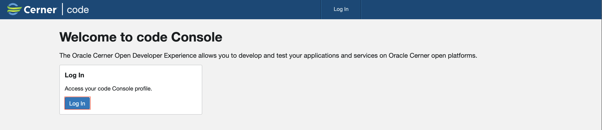
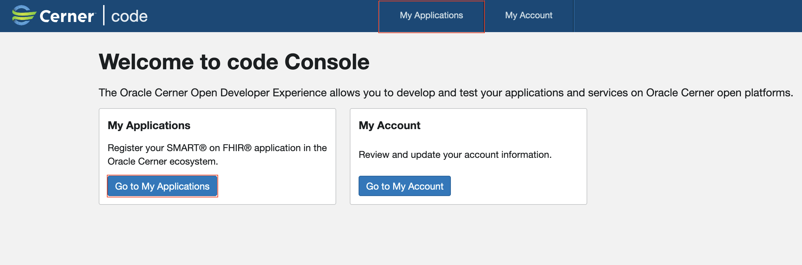
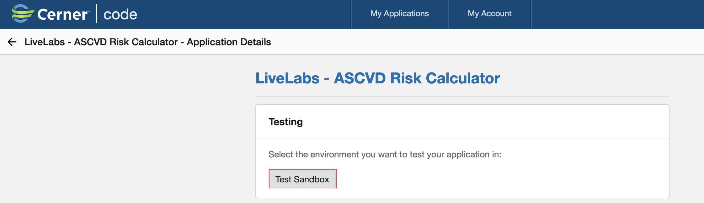

# Run ASCVD Risk Calculator

## Introduction

This lab walks you through the steps to run ASCVD (Atherosclerotic Cardiovascular Disease) Risk Calculator.

Estimated Lab Time: 3 minutes

### Objectives

In this lab, you will:

* Run in Standalone
* Run via Code Console

### Prerequisites

This lab assumes you have:

* An Oracle Cloud account
* All previous labs successfully completed

## Option 1: Standalone

1. Click on **App Builder** and open your app

    

2. Open the application by clicking on the card

    

3. Run the application

    

## Option 2: Code Console

1. Log-in to Code Console

    

2. Go to My Applications in Code Console

    

3. Click on the application name in Code Console

    

4. Click on Test Sandbox

    

5. Select a Patient and click **Next**

    

6. Remember username and password and click on **Launch**

    

## Acknowledgements

* **Author** - Alexandru Basarab, Senior Software Engineer, Open Platform

* **Contributors** - Mircea Iordache, Software Engineer, Open Platform

* **Last Updated By/Date** - Basarab Alexandru, July 2023
